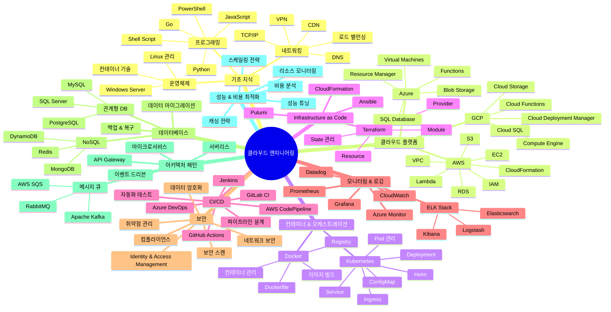

# 클라우드 엔지니어링 로드맵

#roadmap #cloud-engineering #learning-path #devops #aws
## 🗺️ Mermaid 시각화

## 🔗 관련 링크

- **Developer Roadmaps**: https://roadmap.sh/
  - [DevOps 로드맵](https://roadmap.sh/devops)
  - [AWS 로드맵](https://roadmap.sh/aws)