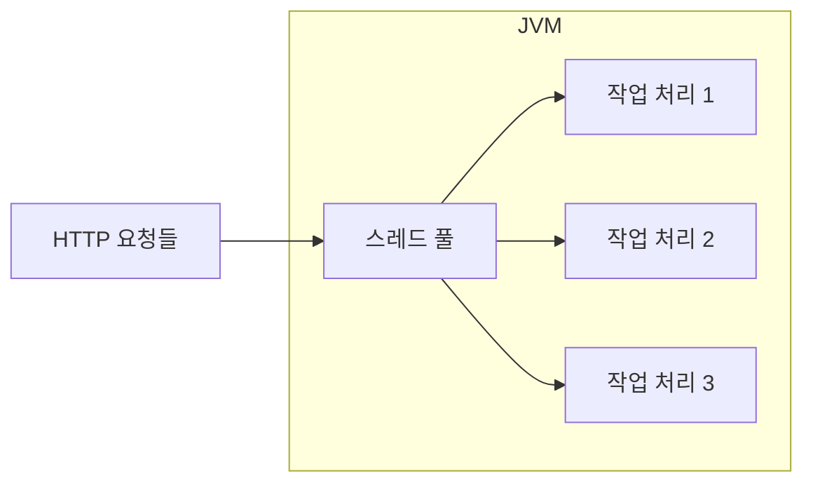
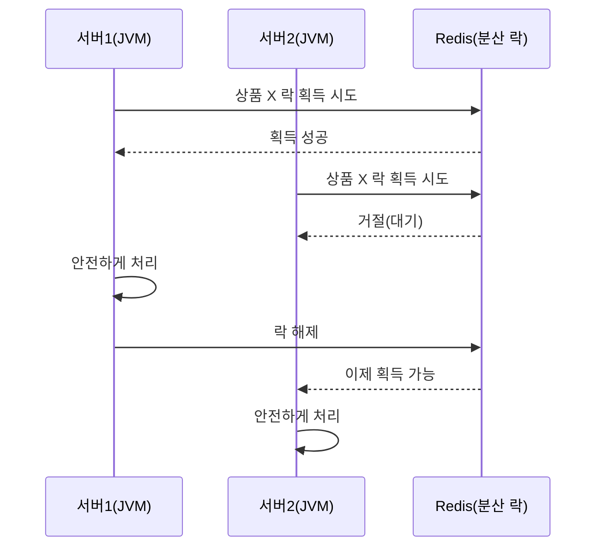

# 동시성 개요: 스레드와 분산 락, 왜 필요한가?

#동시성 #concurrency #병렬 #parallelism #클라우드 #cloud #분산처리 #distributed

---

## 🎯 목표

- 스레드가 무엇이고, 서버에서 왜 중요한지 이해
- 하나의 서버(JVM)와 여러 서버(분산)에서 "같은 자료"를 안전하게 다루는 법 이해
- Redis 같은 외부 시스템으로 분산 락을 거는 이유 알기

## 쉬운 비유

- 한 식당(하나의 서버) 주방에 요리사 여러 명(스레드)이 동시에 요리하면 빨라요. 하지만 같은 냄비(공유 변수)를 같이 잡으면 국물이 쏟아질 수 있어요 → "락"으로 한 번에 한 명만 냄비를 잡게 해요.
- 지점이 여러 개인 프랜차이즈(여러 서버)에서는 가게마다 락을 걸어도 서로 몰라요. 본사(Redis)에 "이 냄비는 현재 A지점이 사용 중"이라고 적어두고, 모두가 본사를 보고 순서를 지켜요 → 분산 락.

## 흐름 그림(단일 서버)

## 흐름 그림(분산 + Redis 락)

## 이 폴더 읽는 순서

- [[01_Thread]] → [[02_ExecutorService_Future]] → [[03_CompletableFuture]] → [[04_Parallel_Stream]] → [[05_동기화_분산락_Redis]]

## 관련 참고

- 스레드 기초는 자바 문법의 메서드/클래스 개념이 필요 — [[../../02_java+basic/03_oop/01_클래스, 객체, 메서드]]
- 함수형 스트림 사고 방식은 — [[../01_함수형+프로그래밍/02_스트림_API_기본]]
