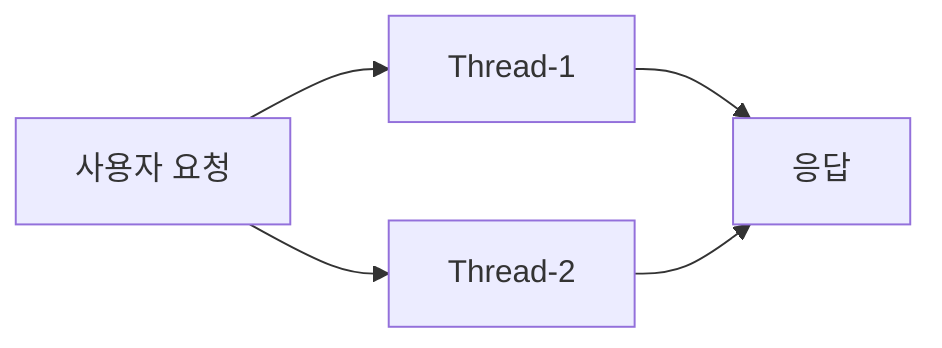

# Thread: 가장 작은 실행 단위 이해하기

#스레드 #thread #컨텍스트스위치 #contextswitch

---

## 한 줄 요약

- 스레드는 작업을 실제로 수행하는 작은 일꾼입니다. 많이 쓰면 빨라질 수 있지만, 관리가 필요합니다.

## 실생활 비유

- 한 사람(프로세스)의 두 손이 동시에 다른 일을 하는 느낌. 하지만 손이 같은 도구를 잡으려면 차례를 지켜야 해요.

## 코드 예시(기본 생성)

```java
Runnable task = () -> {
    System.out.println("작업 시작");
    try { Thread.sleep(1_000); } catch (InterruptedException e) {}
    System.out.println("작업 종료");
};
new Thread(task, "Worker-1").start();
```

## 실무 팁

- 웹서버(Tomcat 등)는 이미 요청마다 스레드를 줍니다. 직접 `new Thread()`를 남발하면 오히려 위험합니다 → 풀 기반 API를 보세요: [[02_ExecutorService_Future]]

## 시각화


