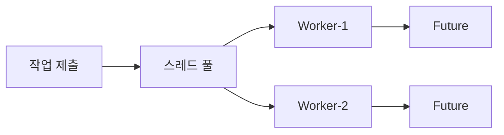

# ExecutorService + Future: 스레드 풀과 작업 핸들

#스레드풀 #executorservice #future #퓨처 #비동기 #async

---

## 개념

- ExecutorService: 재사용 가능한 스레드 묶음(풀). 만들고 부수는 비용 절감
- Future<T>: 비동기 결과에 접근하는 열쇠. 완료 대기(get), 타임아웃, 취소

## 코드

```java
ExecutorService pool = Executors.newFixedThreadPool(4);
List<Future<Integer>> futures = new ArrayList<>();
for (int i = 0; i < 5; i++) {
    futures.add(pool.submit(() -> {
        System.out.println("비동기 작업 시작");
        Thread.sleep(1000);
        System.out.println("비동기 작업 종료");
        return new Random().nextInt();
    }));
}
for (Future<Integer> f : futures) {
    System.out.println(f.get()); // 블로킹
}
pool.shutdown();
```

## 팁

- UI/요청 스레드에서 `get()` 남용 금지. `get(timeout, unit)` 사용으로 무한 대기 방지
- CPU 작업/IO 작업 특성에 따라 풀 크기 조정

## 시각화


