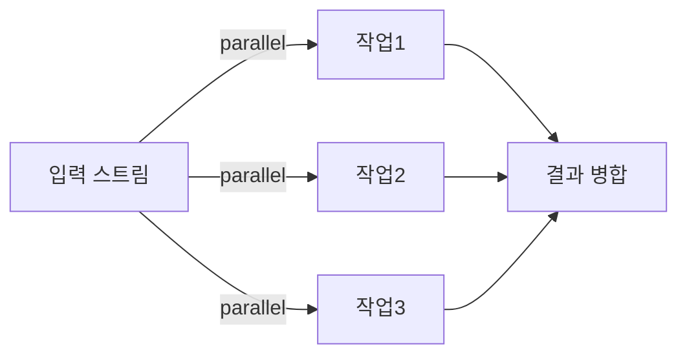

# Parallel Stream: 한 줄 병렬화의 장단점

#parallelstream #stream #스트림 #forkjoin #포크조인

---

## 개념

- `.parallel()` 한 줄로 데이터 병렬 처리. 내부적으로 ForkJoinPool 사용

## 코드

```java
long sum = IntStream.rangeClosed(1, 1_000_000)
                    .parallel()
                    .asLongStream()
                    .sum();
System.out.println(sum);
```

## 팁

- 작은 컬렉션·순서가 중요한 연산에는 부적합할 수 있음
- 서버 전역 공용 풀을 사용하므로, 과도한 병렬화는 다른 기능에 영향을 줄 수 있음

## 시각화


