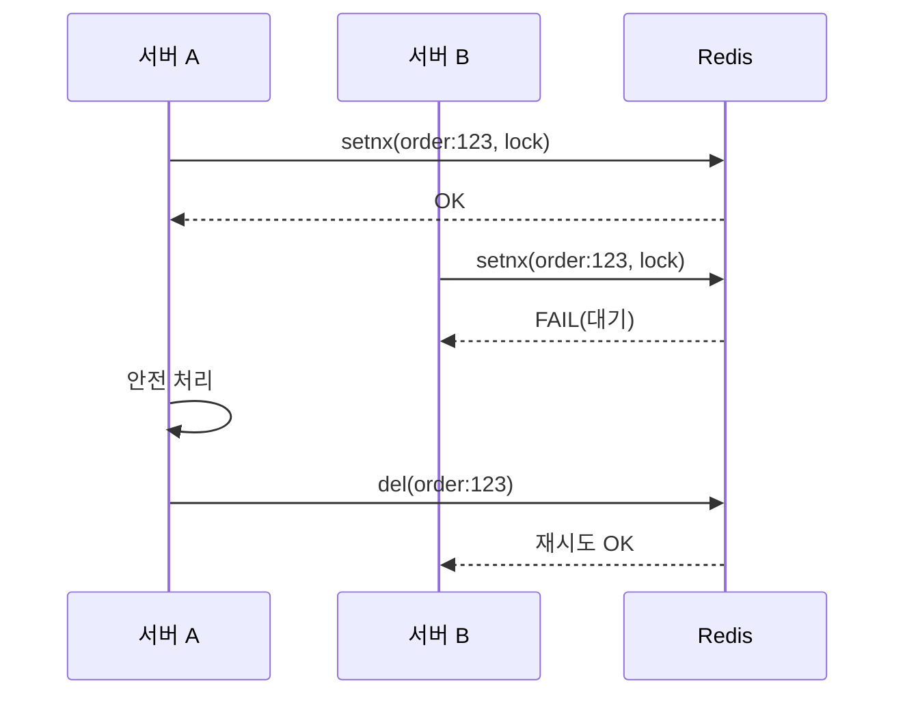

# 동기화와 분산 락: synchronized vs Redis

#synchronized #lock #락 #redis #레디스 #분산락 #distributedlock

---

## 왜 필요한가

- 여러 스레드/서버가 같은 자원을 동시에 바꾸면 값이 엉킬 수 있어요. 이를 막는 안전장치가 락입니다.

## 단일 JVM: synchronized

```java
class Counter {
  private int count = 0;
  public synchronized void inc() { // 임계 구역 보호
    int current = count;
    try { Thread.sleep(new Random().nextInt(10)); } catch (InterruptedException e) {}
    count = current + 1;
  }
  public int getCount() { return count; }
}
```

## 분산 환경: Redis 분산 락 개념

- 여러 서버가 같은 키를 바꾸면? → 각 서버가 Redis에 "나 이 키 사용 중"이라고 등록하고, 끝나면 해제
- 실무 도구: Redisson의 `RLock`, 또는 Lua 스크립트 기반 setnx + expire 패턴

## 시각화(분산 락)



## 주의점

- 락 만료 시간(lease) 설정: 장애 시 영구 락을 방지
- 재시도·백오프 전략 필요
- 락 범위는 최소화하여 경합을 줄이기

## 더 보기

- OOP 계산기의 공유 상태와 비교 — [[../../02_java+basic/03_oop/Exercise+04]]
- 스트림과 상태 공유 이슈 — [[../01_함수형+프로그래밍/02_스트림_API_기본]]
