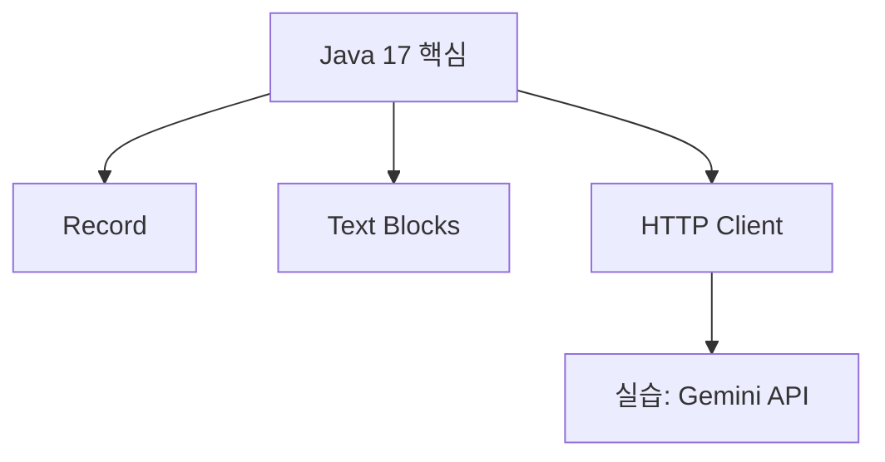

# Java 17 개요와 LTS 흐름

#자바17 #java17 #lts #릴리즈 #release

---

## 목적과 읽는 순서

- Java 17의 대표 기능과 맥락 파악
- LTS 버전 흐름 이해 후, 각 주제 문서로 분할 학습
- 읽는 순서: [[01_Record]] → [[02_Text_Blocks]] → [[03_HTTP_Client]] → [[04_Gemini_API_예제]]

## LTS 버전 큰 흐름

| LTS       | 출시    | 지원 종료 | 대표 변화                                                     |
| --------- | ------- | --------- | ------------------------------------------------------------- |
| 8 (2014)  | 2014‑03 | 2030‑12   | Lambda·Stream API, 새 날짜/시간(`java.time`)                  |
| 11 (2018) | 2018‑09 | 2032‑09   | 모듈 시스템(JPMS), 표준 HTTP Client, `var` 지역 변수, TLS 1.3 |
| 17 (2021) | 2021‑09 | 2029‑10   | Record, Text Blocks, Sealed Class, 패턴 매칭(switch 프리뷰)   |
| 21 (2023) | 2023‑09 | 2031‑09   | 가상 스레드(Project Loom), String Templates(프리뷰)           |

> 최신 LTS 사용을 권장. 현실적으로 8 → 11 → 17 → 21로 이전 중.

## 비유로 이해하기

- Record는 "데이터 전용 상자". 상자를 만들면 라벨(필드)과 기본 기능(`toString/equals/hashCode`)이 자동으로 따라옵니다. #레코드 #record #리코드
- Text Blocks는 "여러 줄 메모를 그대로 붙여 넣기". 따옴표, 개행 이스케이프에서 해방. #텍스트블록 #textblocks #텍스트블록스
- HTTP Client는 "브라우저 없이 편지 보내기". GET/POST를 코드로 간단히. #http클라이언트 #httpclient #에이치티티피클라이언트

## 한눈에 보는 학습 지도

## 관련 참고

- OOP 기초: [[../../02_java+basic/03_oop/01_클래스, 객체, 메서드]]
- 입력/출력 기초: [[../../02_java+basic/01_syntax/Syntax/03_입력]] · [[../../02_java+basic/01_syntax/Syntax/02_출력]]
