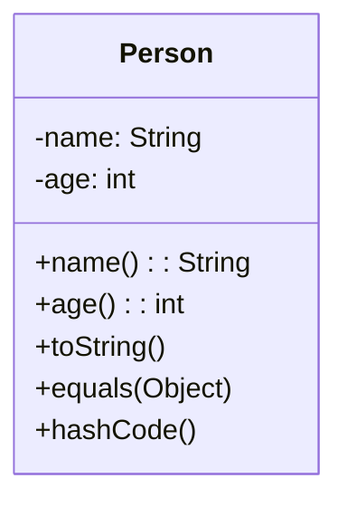

# Record: 데이터 전용 클래스 간결하게 만들기

#레코드 #record #데이터클래스 #dto

---

## 요약

- 불변 데이터 운반 객체를 보일러플레이트 없이 정의하는 문법
- 생성자, 접근자, `equals/hashCode/toString` 자동 생성

## 기본 문법

```java
public record Person(String name, int age) {}

Person p = new Person("Lee", 20);
System.out.println(p.name()); // "Lee"
```

## 활용 팁

- DTO/Value Object에 적합. 컬렉션 키로도 안전하게 사용 가능
- 직렬화 라이브러리(Jackson/Gson)와 자연스럽게 동작

## 주의

- 필드는 기본적으로 final. 변경이 필요하면 일반 클래스를 고려

## 시각화


