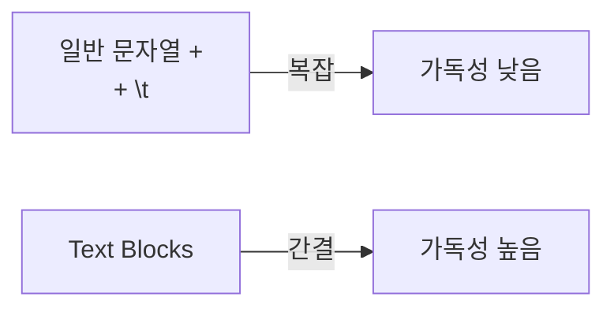

# Text Blocks: 여러 줄 문자열을 그대로

#텍스트블록 #textblocks #멀티라인 #문자열 #string

---

## 요약

- 세 개의 큰따옴표로 감싼 멀티라인 문자열 리터럴
- JSON/SQL/HTML 본문을 가독성 있게 작성

## 예시

```java
String json = """
{
  "name": "Lee",
  "age": 20
}
""";
```

## 포맷팅과 이스케이프

```java
String name = "Lee";
String s = """
Hello, %s
""".formatted(name);
```

- 따옴표/개행 이스케이프를 최소화. 필요 시 `replace("\"", "\\\"")`로 안전 처리

## 시각화(사용 전/후)


