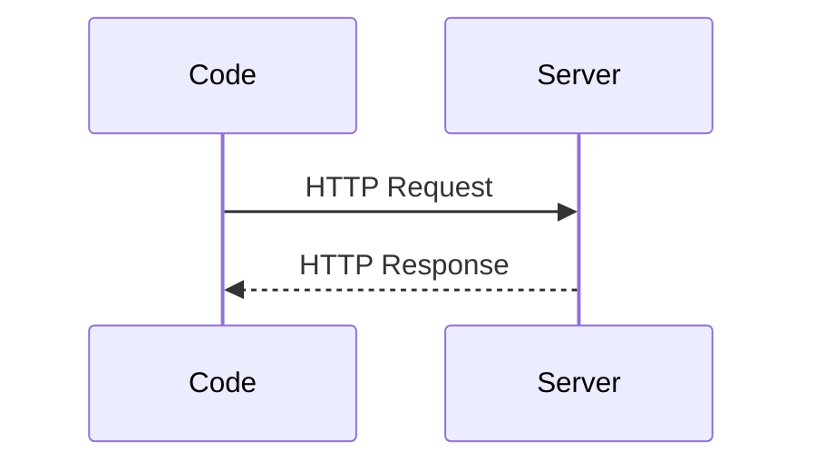

# HTTP Client: 자바 표준으로 API 호출하기

#http클라이언트 #httpclient

---

## 요약

- Java 11에 도입된 표준 `HttpClient`로 의존성 없이 HTTP 호출

## 기본 예제

```java
HttpClient client = HttpClient.newHttpClient();
HttpRequest req = HttpRequest.newBuilder(URI.create("https://httpbin.org/get"))
                             .GET()
                             .build();
HttpResponse<String> res = client.send(req, HttpResponse.BodyHandlers.ofString());
System.out.println(res.body());
```

## POST + Text Blocks 결합

```java
String body = """
{ "hello": "world" }
""";
HttpRequest post = HttpRequest.newBuilder(URI.create("https://httpbin.org/post"))
    .header("Content-Type", "application/json")
    .POST(HttpRequest.BodyPublishers.ofString(body))
    .build();
```

## 시각화


