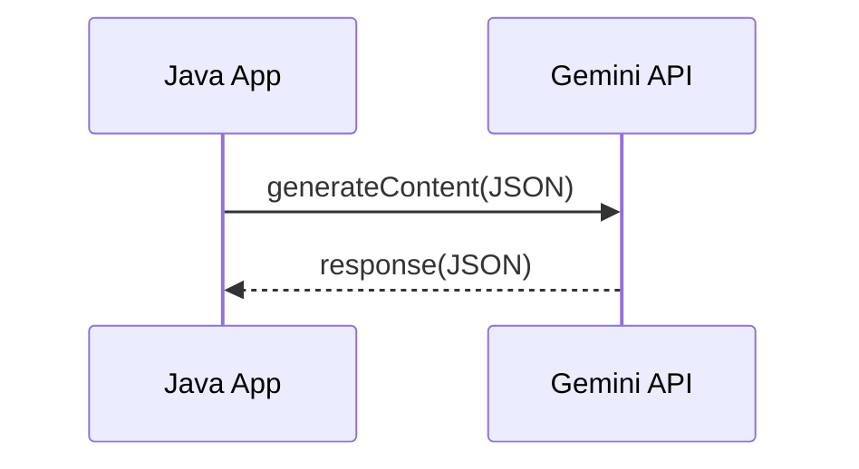

# Gemini 2.0 Flash API: 순수 Java로 호출하기

#제미나이 #gemini #flash #api #http #json

---

## 준비

- 키 발급: https://aistudio.google.com/apikey

## 코드

```java
import java.net.http.*;
import java.net.*;

public class GeminiClient {
    private static final HttpClient CLIENT = HttpClient.newHttpClient();
    private static final String KEY = System.getenv("GEMINI_API_KEY");
    private static final String ENDPOINT =
        "https://generativelanguage.googleapis.com/v1beta/models/gemini-2.0-flash:generateContent?key=" + KEY;

    // 한국어 주석: 프롬프트를 받아 JSON 본문을 만든 뒤 POST 요청을 생성
    private static HttpRequest buildRequest(String prompt) {
        String body = """
          {
            "contents": [
              { "parts": [ { "text": "%s" } ] }
            ]
          }
          """.formatted(prompt.replace("\"", "\\\""));
        return HttpRequest.newBuilder(URI.create(ENDPOINT))
                .header("Content-Type", "application/json")
                .POST(HttpRequest.BodyPublishers.ofString(body))
                .build();
    }

    public static void main(String[] args) throws Exception {
        if (KEY == null || KEY.isBlank()) {
            System.err.println("GEMINI_API_KEY 환경 변수가 필요합니다.");
            return;
        }
        HttpRequest req = buildRequest("Java Record와 Text Blocks 설명해줘.");
        HttpResponse<String> res = CLIENT.send(req, HttpResponse.BodyHandlers.ofString());
        System.out.println(res.body());
    }
}
```

## 시각화


