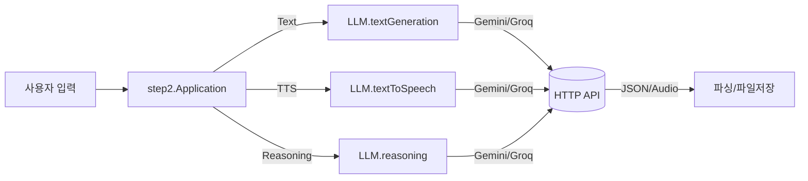

# Exercise 07.5: Java 17 Records + 텍스트 블록으로 모던 LLM SDK 모듈화 (Gemini/Groq)

- 예제 소스: https://github.com/notlikelion/250806_modern-java/tree/main/src/step2

#자바17 #java17 #레코드 #record #텍스트블록 #textblocks #HTTP클라이언트 #httpclient #LLM #gemini #제미나이 #그록 #groq #음성합성 #tts #Reasoning #추론

---

## 🎯 학습 목표

- Java 17의 [[01_Record]]와 [[02_Text_Blocks]], [[03_HTTP_Client]]를 활용하여 LLM 호출을 모듈화
- 템플릿/모델/프롬프트를 분리한 레코드 기반 DTO로 명확한 파라미터 전달
- 공급자(Gemini/Groq) 교체 가능 구조(인터페이스)와 최소 파싱 패턴 이해
- 기초 예제는 [[Exercise+07]] 및 [[04_Gemini_API_예제]]를 참고, 배경은 [[00_개요_및_LTS]] 참조

#모듈화 #modularization

---

## 📋 사전 준비사항

1. JDK 17 이상, IDE 설정 — [[../02_java+basic/01_syntax/IntelliJ/00_개요_및_설치/00_IntelliJ_IDEA_개요]] · [[../02_java+basic/01_syntax/IntelliJ/01_초기설정/00_JDK_설정]]
2. 환경 변수: `GEMINI_API_KEY`, `GROQ_API_KEY`
3. 참고 문서: [[01_Record]] · [[02_Text_Blocks]] · [[03_HTTP_Client]] · [[04_Gemini_API_예제]]

#환경변수 #environmentvariable

---

## 🧭 빠른 참조(클래스/메서드)

- Record: `record Name(...) {}` — 불변 DTO, 자동 생성자/접근자([[01_Record]])
- Text Blocks: `""" ... """.formatted(...)` — 가독성 좋은 본문 템플릿([[02_Text_Blocks]])
- HTTP: `HttpClient.newHttpClient()`, `HttpRequest.newBuilder()`, `HttpResponse.BodyHandlers.ofString()/ofByteArray()`([[03_HTTP_Client]])
- 파일 I/O: `Paths.get`, `Files.write`, `Files.writeString`
- Base64 디코드 및 `javax.sound.sampled`로 WAV 저장(PCM → WAV)

#파일IO #fileio #요청 #응답 #request #response

---

## 🗺️ 구성 개요



- `LLM` 인터페이스로 공급자 구현체 `Gemini`, `Groq`를 교체 가능하게 설계 — [[Exercise+07]]의 단일 구현 예제를 확장한 형태.

#인터페이스 #interface

---

### 1) 데이터 모델(Record)

```java
package step2.data;

// 모델 종류를 한정 — 컴파일 시점 안정성 확보
public enum AIModel { KIMI, MAVERICK, VERSATILE, GEMINI_FLASH, PLAYAI, GEMINI_FLASH_TTS, QWEN, GPT, DEEPSEEK, GEMINI_PRO }

// 음성 보이스(일부) — Gemini 보이스는 문서 링크 참고
public enum AIVoice { achernar, achird, algenib /* ... */ }

// 텍스트 생성 파라미터/결과
public record TextGenerationParam(AIModel model, String template, String prompt) { }
public record TextGenerationResult(String content, String prompt) { }

// TTS 파라미터/결과
public record TextToSpeechParam(AIModel model, String template, String prompt, AIVoice voice) { }
public record TextToSpeechResult(String content, String prompt) { }

// Reasoning 파라미터/결과
public record ReasoningParam(AIModel model, String template, String prompt) { }
public record ReasoningResult(String content, String prompt, String thinking) { }
```

#레코드 #record

### 2) 인터페이스

```java
package step2.biz;

import step2.data.*;

public interface LLM {
    TextGenerationResult textGeneration(TextGenerationParam param);
    TextToSpeechResult textToSpeech(TextToSpeechParam param);
    ReasoningResult reasoning(ReasoningParam param);
}
```

### 3) Gemini 구현

```java
public class Gemini implements LLM {
    final private String GEMINI_API_KEY = System.getenv("GEMINI_API_KEY");

    @Override
    public TextGenerationResult textGeneration(TextGenerationParam param) {
        String modelName = switch (param.model()) {
            case GEMINI_FLASH -> "gemini-2.0-flash";
            default -> throw new RuntimeException("지원하지 않는 모델");
        };
        HttpRequest request = HttpRequest.newBuilder()
            .uri(URI.create("https://generativelanguage.googleapis.com/v1beta/models/%s:generateContent".formatted(modelName)))
            .headers("Content-Type", "application/json", "X-goog-api-key", GEMINI_API_KEY)
            .POST(HttpRequest.BodyPublishers.ofString(param.template().formatted(param.prompt())))
            .build();
        HttpClient client = HttpClient.newHttpClient();
        try {
            HttpResponse<String> res = client.send(request, HttpResponse.BodyHandlers.ofString());
            String body = res.body();
            String result = body.split("text\": \"")[1]
                                .split("}")[0]
                                .replace("\\n", "")
                                .replace("\"", "")
                                .trim();
            return new TextGenerationResult(result, param.prompt());
        } catch (Exception e) { throw new RuntimeException(e); }
    }
}
```

- 텍스트 블록 템플릿은 호출부에서 `.formatted(prompt)`로 주입 — [[02_Text_Blocks]]
- HTTP 호출/파싱은 [[03_HTTP_Client]] 패턴 준수. 간단 파싱은 `split` 사용(프로덕션에서는 JSON 파서 고려)

### 4) Groq 구현(발췌)

```java
public class Groq implements LLM {
    @Override
    public TextGenerationResult textGeneration(TextGenerationParam param) {
        String modelName = switch (param.model()) {
            case KIMI -> "moonshotai/kimi-k2-instruct";
            case MAVERICK -> "meta-llama/llama-4-maverick-17b-128e-instruct";
            case VERSATILE -> "llama-3.3-70b-versatile";
            default -> throw new RuntimeException("지원하지 않는 모델");
        };
        String apiKey = System.getenv("GROQ_API_KEY");
        HttpRequest request = HttpRequest.newBuilder()
            .uri(URI.create("https://api.groq.com/openai/v1/chat/completions"))
            .headers("Content-Type", "application/json", "Authorization", "Bearer %s".formatted(apiKey))
            .POST(HttpRequest.BodyPublishers.ofString(param.template().formatted(param.prompt(), modelName)))
            .build();
        try {
            HttpResponse<String> res = HttpClient.newHttpClient().send(request, HttpResponse.BodyHandlers.ofString());
            String content = res.body().split("\"content\":\"")[1].split("\"}")[0].trim();
            return new TextGenerationResult(content, param.prompt());
        } catch (Exception e) { throw new RuntimeException(e); }
    }
}
```

### 5) Application 사용 예

```java
package step2;

import step2.biz.*;
import step2.data.*;
import java.nio.file.*;

public class Application {
    public static void main(String[] args) {
        // LLM llm = new Groq();
        LLM llm = new Gemini();

        // 1) 텍스트 생성 템플릿(텍스트 블록) — 결과만 출력하도록 간단 지시
        String tem = """
        {
          "contents": [
            {"role": "user", "parts": [ {"text": "%s"} ]}
          ]
        }
        """;
        String result = llm.textGeneration(new TextGenerationParam(
                AIModel.GEMINI_FLASH, tem, "내일 아침 메뉴 추천 좀" )).content();
        System.out.println(result);

        // 2) Reasoning — 결과를 파일로 저장
        ReasoningResult reasoning = llm.reasoning(new ReasoningParam(
                AIModel.GEMINI_PRO, tem, "AWS에서 가장 중요한 것들"));
        try {
            Path filename = Paths.get(System.currentTimeMillis() + ".md");
            Files.writeString(filename, reasoning.content().replace("\\n", "\n"));
        } catch (Exception e) { throw new RuntimeException(e); }
    }
}
```

#텍스트블록 #textblocks #요청템플릿

---

## 🔧 실행 및 테스트

1. 환경 변수 설정: `GEMINI_API_KEY`, `GROQ_API_KEY`
2. `step2.Application.main` 실행
   - Text Generation: 콘솔에 결과 출력
   - Reasoning: `<타임스탬프>.md` 저장
   - TTS: 템플릿과 보이스는 Gemini 문서 참고 — https://ai.google.dev/gemini-api/docs/speech-generation?hl=ko#voices
3. 텍스트 블록의 `.formatted(...)`로 템플릿/모델/프롬프트를 유연하게 교체

#실행 #run #런 #보이스 #voice #보이스

---

## ✅ 요약

- [[01_Record]]로 파라미터/결과를 명확히 모델링하고, [[02_Text_Blocks]]로 요청 템플릿을 가독성 있게 유지
- [[03_HTTP_Client]]로 동기 호출을 단순화, 최소 파싱으로 `content`만 추출
- `LLM` 인터페이스로 공급자 교체가 쉬운 구조를 확보, [[Exercise+07]]에서 다룬 단일 구현을 확장해 실전 형태로 구성
- 전체 소스는 상단 GitHub 링크 확인, 세부 API는 [[04_Gemini_API_예제]] 참조
