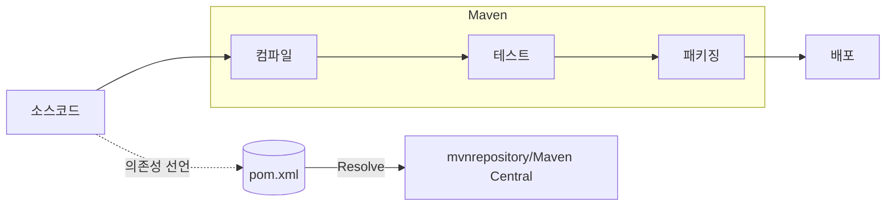

# 의존성 개요와 Maven, 그리고 mvnrepository

#의존성 #dependency #빌드도구 #buildtool #빌드툴 #메이븐 #maven #메이븐리포지토리 #mvnrepository

---

## 🎯 학습 목표

- 의존성, 라이브러리, 프레임워크의 차이를 이해하고 실무 맥락에 연결
- Maven이 하는 일과 mvnrepository의 역할을 파악해 필요한 의존성을 스스로 찾고 적용
- 표준 디렉터리/명령 체계를 통해 일관된 빌드 흐름을 익히기

관련 배경: [[../03_Java17/02_Text_Blocks]] · [[../03_Java17/03_HTTP_Client]]

---

## 🧠 핵심 개념 한 눈에

- 빌드 도구(Build Tool): 컴파일 → 테스트 → 패키징 → 배포까지 자동화하는 도구
  - Java 진영 대표: Maven, Gradle, Ant
- Maven: `pom.xml` 하나로 프로젝트 정보/의존성/플러그인을 선언하고 표준 절차로 실행
  - Convention over Configuration(관습 우선) 철학 → 설정은 간결, 결과는 일관
  - 전이(Transitive) 의존성 자동 해결: 선언한 라이브러리가 필요로 하는 하위 의존성까지 함께 설치
- mvnrepository.com: Maven Central 등 여러 저장소를 색인해 검색/버전/라이선스/의존성 트리를 제공하는 포털

---

## 🔁 빌드·의존성 처리 흐름

실생활 비유: 레고 설명서(pom.xml)에 필요한 블록(의존성) 목록과 조립 순서(목표/플러그인)가 적혀 있고, 창고(mvnrepository)에서 부품을 자동으로 찾아와 조립하는 느낌입니다.

---

## 📌 기억할 점

- 의존성은 ‘남이 잘 만들어 둔 부품’을 가져다 쓰는 것. 생산성을 비약적으로 높여주지만 버전/호환성 관리가 필요
- 무조건 최신이 정답은 아니나, 보안 패치가 포함된 patch 버전은 가급적 최신을 권장
- 표준 디렉터리 구조(`src/main/java`, `src/test/java`)와 명령(`mvn test`, `mvn package`)을 따르면 팀 간 일관성 확보

---

## 🔗 참고 링크

- Maven 공식: https://maven.apache.org/
- Maven Central 검색 포털: https://mvnrepository.com/
- 예시(GenAI SDK): https://mvnrepository.com/artifact/com.google.genai/google-genai
- .env 로더: https://mvnrepository.com/artifact/io.github.cdimascio/dotenv-java
- Jackson Databind: https://mvnrepository.com/artifact/com.fasterxml.jackson.core/jackson-databind
