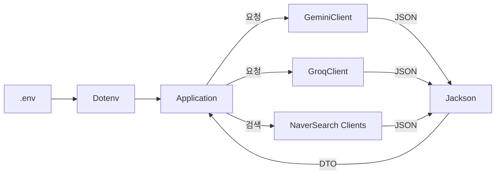

# Exercise 08: Maven 의존성으로 LLM 클라이언트 통합(google-genai · dotenv · Jackson)

- 실습 스크린샷 : https://viewer.diagrams.net/#Uhttps%3A%2F%2Fdrive.google.com%2Fuc%3Fid%3D1USr4WvTj6aGKyR3zAZhcb9wRaiUOI284%26export%3Ddownload

* 참고: [[00_개요_Maven_mvnrepository]] · [[01_의존성_라이브러리_프레임워크]] · [[02_Maven_의존성_선언과_버전]] · [[03_JSON_HTTP_기본과_Jackson]] · [[04_실전_예제_Groq_Gemini]]
* Java 17 기반 LLM 예제 형식 참고: [[../03_Java17/Exercise+07]] · [[../03_Java17/Exercise+075]]

#의존성 #dependency #메이븐 #maven #자바17 #java17 #HTTP클라이언트 #httpclient #jackson #닷엔브 #dotenv #환경변수 #environmentvariable #LLM #그록 #groq #제미나이 #gemini

---

## 🎯 학습 목표

- Maven 의존성 선언과 버전 고정 방식([[02_Maven_의존성_선언과_버전]])을 이해하고 적용
- `google-genai`, `dotenv-java`, `jackson-databind`를 이용해 LLM 호출 코드 구성
- [[../03_Java17/Exercise+07]]·[[../03_Java17/Exercise+075]]의 인터페이스/레코드/텍스트 블록 패턴을 의존성 관점에서 재구성

#모듈화 #modularization #레코드 #record #텍스트블록 #textblocks

---

## 📋 빠른 참조(클래스/메서드)

- Maven 좌표: `groupId/artifactId:version` — 중앙 저장소 [[00_개요_Maven_mvnrepository]]
- Dotenv: `Dotenv.load().get("KEY")` — .env에서 키 로딩
- Jackson: `ObjectMapper.readValue(...)` · `@JsonIgnoreProperties(ignoreUnknown = true)`([[03_JSON_HTTP_기본과_Jackson]])
- Java 17 텍스트 블록: `""" {...} """.formatted(...)`([[../03_Java17/02_Text_Blocks]])
- HTTP: `HttpClient.newHttpClient()`([[../03_Java17/03_HTTP_Client]])

---

## 🗺️ 구성 개요



- 핵심 아이디어: 의존성으로 가져온 라이브러리들로 네트워크 호출/파싱/비밀키 관리의 재사용 코드를 줄이고, [[../03_Java17/Exercise+07]]처럼 인터페이스 중심으로 교체 가능하게 구성.

#인터페이스 #interface

---

## 1) POM 의존성 선언

- 중앙 저장소에서 최신 버전 확인: https://mvnrepository.com/
- 버전은 프로젝트 기준으로 고정하여 재현성 확보([[02_Maven_의존성_선언과_버전]]).

```xml
<!-- pom.xml 발췌 -->
<project>
  <properties>
    <maven.compiler.source>17</maven.compiler.source>
    <maven.compiler.target>17</maven.compiler.target>
    <project.build.sourceEncoding>UTF-8</project.build.sourceEncoding>
  </properties>

  <dependencies>
    <!-- Google Gemini SDK (HTTP/JSON 래퍼) -->
    <dependency>
      <groupId>com.google.genai</groupId>
      <artifactId>google-genai</artifactId>
      <version>1.10.0</version>
    </dependency>

    <!-- .env 환경변수 로더 -->
    <dependency>
      <groupId>io.github.cdimascio</groupId>
      <artifactId>dotenv-java</artifactId>
      <version>3.2.0</version>
    </dependency>

    <!-- JSON 직렬화/역직렬화 -->
    <dependency>
      <groupId>com.fasterxml.jackson.core</groupId>
      <artifactId>jackson-databind</artifactId>
      <version>2.19.2</version>
    </dependency>
  </dependencies>
</project>
```

- 의존성은 “요리에 필요한 재료”와 같음. Maven은 레시피에 적힌 재료(좌표)를 보고 자동으로 내려 받음.

#메이븐 #maven

---

## 2) 애플리케이션 뼈대(Java 17)

- [[../03_Java17/Exercise+07]]의 흐름을 의존성 관점으로 재배열.
- 텍스트 블록에 프롬프트/모델을 주입.

```java
package chatbot;

import chatbot.api.GeminiClient;
import chatbot.api.GroqClient;
import chatbot.api.NaverBlogSearchClient;
import chatbot.api.NaverNewsSearchClient;
import chatbot.data.GeminiModel;
import chatbot.data.GroqModel;
import io.github.cdimascio.dotenv.Dotenv;

import java.util.List;
import java.util.Scanner;

public class Application {
    public static void main(String[] args) {
        // 1) .env 로드(환경변수) — 키/설정 분리
        Dotenv dotenv = Dotenv.load();
        String systemInstruction = dotenv.get("SYSTEM_INSTRUCTION");

        // 2) 클라이언트 준비 — SDK/HTTP + Jackson 내부 사용
        GeminiClient geminiClient = new GeminiClient(GeminiModel.gemini_2_0_flash, systemInstruction);
        GroqClient groqClient = new GroqClient("" /* 필요 시 기본 시스템 프롬프트 */);
        NaverBlogSearchClient blogClient = new NaverBlogSearchClient();
        NaverNewsSearchClient newsClient = new NaverNewsSearchClient();

        // 3) 간단 대화 루프
        try (Scanner sc = new Scanner(System.in)) {
            while (true) {
                System.out.print("질문 : ");
                String input = sc.nextLine();
                if (input.equals("종료")) return;

                // 3-1) 네이버 검색 호출 → 문자열 요약용으로 변환
                List<String> blogResult = blogClient.search(input)
                        .stream()
                        .map(item -> "제목 : %s\n설명: %s\n링크: %s\n작성일 : %s".formatted(
                                item.title(), item.description(), item.link(), item.postdate()))
                        .toList();
                List<String> newsResult = newsClient.search(input)
                        .stream()
                        .map(item -> "제목 : %s\n설명: %s\n링크: %s\n작성일 : %s".formatted(
                                item.title(), item.description(), item.link(), item.pubDate()))
                        .toList();

                // 3-2) 텍스트 블록 템플릿([[../03_Java17/02_Text_Blocks]])
                String prompt = """
                        아래의 내용들을 200자 이내로 요약해줘.\n
                        [블로그]\n%s\n\n[뉴스]\n%s
                        """.formatted(blogResult, newsResult);

                // 3-3) LLM 호출 — 두 공급자 비교([[../03_Java17/Exercise+075]])
                String geminiResult = geminiClient.chat(prompt).trim();
                String groqResult = groqClient.chat(prompt, GroqModel.gpt_oss_120b).trim();

                System.out.println("제미나이 : %s".formatted(geminiResult));
                System.out.println("그록(GPT) : %s".formatted(groqResult));
            }
        }
    }
}
```

#텍스트블록 #textblocks

---

## 3) 모델/DTO 예시

- 익숙하지 않은 JSON 필드는 무시하여 파싱 오류를 줄임 — `@JsonIgnoreProperties(ignoreUnknown = true)`([[03_JSON_HTTP_기본과_Jackson]]).
- 모델/레코드 패턴은 [[../03_Java17/Exercise+075]]의 `record` 예시를 참고.

```java
package chatbot.data;

public enum GeminiModel {
    gemini_2_0_flash("gemini-2.0-flash"),
    gemini_2_5_flash("gemini-2.5-flash");
    private final String modelName;
    GeminiModel(String modelName) { this.modelName = modelName; }
    @Override public String toString() { return modelName; }
}

public enum GroqModel {
    gpt_oss_120b("openai/gpt-oss-120b");
    private final String modelName;
    GroqModel(String modelName) { this.modelName = modelName; }
    @Override public String toString() { return modelName; }
}
```

```java
package chatbot.data;

// Groq Chat 요청 바디
public record GroqRequestBody(java.util.List<Message> messages, String model) {
    public record Message(String role, String content) {}
}
```

```java
package chatbot.data;

import com.fasterxml.jackson.annotation.JsonIgnoreProperties;
import java.util.List;

// Groq Chat 응답 바디(필요 필드만)
@JsonIgnoreProperties(ignoreUnknown = true)
public record GroqResponseBody(List<Choice> choices) {
    @JsonIgnoreProperties(ignoreUnknown = true)
    public record Choice(Message message) {}
    public record Message(String role, String content, String reasoning) {}
}
```

- 네이버 검색 응답도 동일한 방식으로 `record` + `@JsonIgnoreProperties`를 적용하면 안정적.

#레코드 #record #제이슨 #json

---

## 4) 실행 방법

1. .env 파일에 키 설정([[01_의존성_라이브러리_프레임워크]])
   - `GEMINI_API_KEY`, `GROQ_API_KEY`, `NAVER_CLIENT_ID`, `NAVER_CLIENT_SECRET`
2. IDE/JDK 17 설정 확인([[../02_java+basic/01_syntax/IntelliJ/01_초기설정/00_JDK_설정]])
3. 애플리케이션 실행 → 콘솔에서 “질문” 입력 → 결과 비교 출력

#실행 #run #환경변수 #environmentvariable

---

## ✅ 요약

- Maven 의존성으로 LLM SDK/유틸을 가져오고, 환경변수/JSON 파싱을 표준화하면 구현이 단순해짐.
- [[../03_Java17/Exercise+07]]의 단일 구현, [[../03_Java17/Exercise+075]]의 인터페이스/레코드 분리를 결합해 교체 가능한 구조 완성.
- 세부 API 사용은 [[04_실전_예제_Groq_Gemini]]와 각 라이브러리 문서를 참조.
