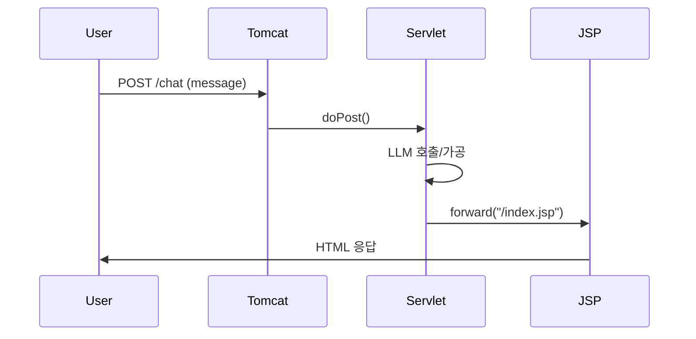

# Servlet/JSP 기본 예제

- 참고: [[../03_Java17/Exercise+07]] · [[../03_Java17/Exercise+075]]

#서블릿 #servlet #제이에스피 #jsp #자바17 #java17 #텍스트블록 #textblocks

---

## Servlet 구현

```java
package demo;

import jakarta.servlet.ServletException;
import jakarta.servlet.annotation.WebServlet;
import jakarta.servlet.http.HttpServlet;
import jakarta.servlet.http.HttpServletRequest;
import jakarta.servlet.http.HttpServletResponse;
import java.io.IOException;

@WebServlet("/chat")
public class GeminiServlet extends HttpServlet {
    @Override
    protected void doPost(HttpServletRequest req, HttpServletResponse resp)
            throws IOException, ServletException {
        String user = req.getParameter("message");
        // TODO: google-genai SDK 또는 HttpClient로 LLM 호출 (Exercise+08 참고)
        String answer = """
                입력: %s\n
                이 영역에 LLM 호출 결과를 출력하세요.
                """.formatted(user);
        req.setAttribute("answer", answer);
        req.getRequestDispatcher("/index.jsp").forward(req, resp);
    }
}
```

## JSP 뷰

```html
<%@ page contentType="text/html; charset=UTF-8" pageEncoding="UTF-8" %>
<html>
  <head>
    <meta charset="UTF-8" />
    <title>Gemini Chat</title>
  </head>
  <body>
    <form action="chat" method="post">
      <input name="message" placeholder="Ask Gemini" />
      <button>Send</button>
    </form>
    <pre>${answer}</pre>
  </body>
</html>
```

---

## 흐름도


