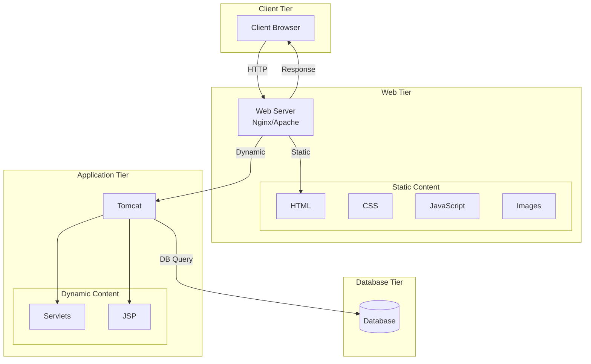
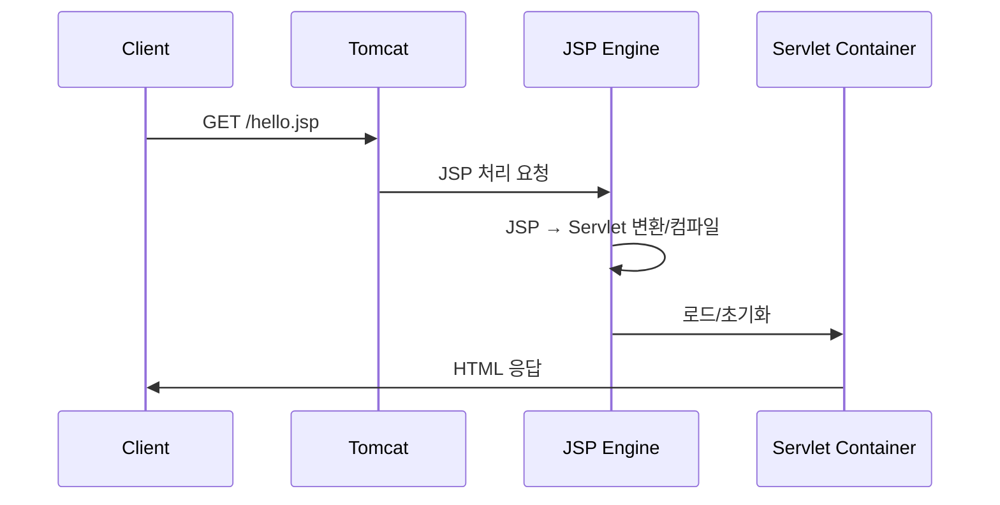

# WAS/WS 개념 도해

- 배경: [[00_개요_및_로드맵]]

#WAS #웹서버 #webserver #와스 #웹서버 #톰캣 #tomcat

---

## 역할 구분

- Web Server: 정적 파일 서빙, 리버스 프록시/로드밸런싱
- WAS(Tomcat): 서블릿/JSP 실행, 세션/보안/트랜잭션 관리

---

## JSP 처리 시퀀스

