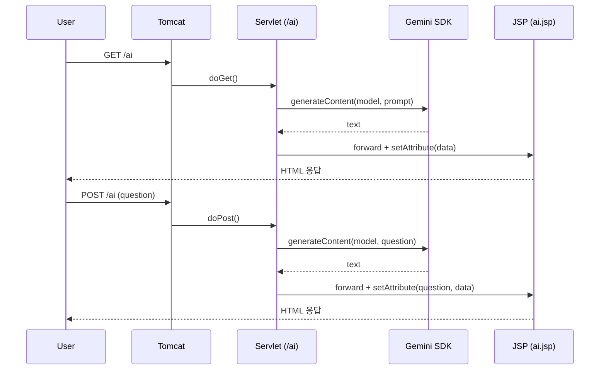

# Exercise 09: Servlet/JSP로 Gemini 연동 웹 챗봇 만들기

- 실습 스크린샷: https://viewer.diagrams.net/#Uhttps%3A%2F%2Fdrive.google.com%2Fuc%3Fid%3D1j2kXpeFlibxgRlXPuGb7zGG-ZOp8ExT1%26export%3Ddownload
- 참고: [[00_개요_및_로드맵]] · [[01_프로젝트_구성_및_의존성]] · [[02_Servlet_JSP_기본_예제]] · [[03_Docker_Render_배포]] · [[04_WAS_WS_개념_도해]]
- 연계: [[../04_의존성/Exercise+08]] · [[../03_Java17/Exercise+07]] · [[../03_Java17/Exercise+075]]

#서블릿 #servlet #제이에스피 #jsp #톰캣 #tomcat #의존성 #dependency #환경변수 #environmentvariable #자바17 #java17 #텍스트블록 #textblocks #텍스트블록 #배포 #deployment #디플로이먼트 #LLM #제미나이 #gemini

---

## 🎯 학습 목표

- Servlet/JSP와 Tomcat으로 기본 웹 앱을 만들고, Gemini SDK로 서버사이드 LLM 호출을 연동
- 요청 처리 흐름(Request → Servlet → JSP Forward)을 코드와 도식으로 이해
- .env 기반 비밀키 관리와 배포 환경(예: Render)에서의 설정 차이 이해

#시크릿 #secret

---

## 📋 빠른 참조

- URL 매핑: `@WebServlet("/ai")`, `@WebServlet("/")`
- Forward: `req.getRequestDispatcher("/WEB-INF/ai.jsp").forward(req, resp)`
- Dotenv: `Dotenv.load()`(로컬), `Dotenv.configure().ignoreIfMissing().load()`(배포)
- Gemini: `Client.builder().apiKey(key).build()` → `client.models.generateContent(...)`
- JSP: `<%= request.getAttribute("data") %>` 로 request attribute 출력
- 의존성: [[01_프로젝트_구성_및_의존성]] · [[../04_의존성/Exercise+08]]

---

## 🗺️ 구성 개요



---

## 0) 준비

- pom.xml에 `jakarta.servlet-api`(scope=provided), `com.google.genai:google-genai`, `io.github.cdimascio:dotenv-java` 추가 — 버전/주석은 [[01_프로젝트_구성_및_의존성]] 참고.
- 로컬 실행은 `.env`(resources)에 `GOOGLE_API_KEY=...` 저장. 배포는 플랫폼 시크릿 사용([[03_Docker_Render_배포]]).

#메이븐 #maven #dotenv #닷엔브

---

## 1) 기본: Servlet → JSP Forward

- 실습 참고: https://gist.github.com/notlikelion/6e12d8a30cff0c899d7780b3e44f58b2

```jsp
<%@ page contentType="text/html; charset=UTF-8" pageEncoding="UTF-8" %>
<html>
<head><title>AI 너무 좋아!</title></head>
<body>
  <p><%= request.getAttribute("data") %></p>
</body>
</html>
```

```java
// /ai 요청 시 JSP로 포워딩
@WebServlet("/ai")
public class AIServlet extends HttpServlet {
  @Override
  protected void doGet(HttpServletRequest req, HttpServletResponse resp)
      throws ServletException, IOException {
    req.setAttribute("data", "안녕하세요! 반갑습니다!"); // [1] JSP로 데이터 전달
    req.getRequestDispatcher("/WEB-INF/ai.jsp").forward(req, resp); // [2]
  }
}
```

#포워드 #forward

---

## 2) GET: Gemini SDK 연동

- 키 로딩과 SDK 호출 패턴은 [[../04_의존성/Exercise+08]] 형식 준수.
- 실습 참고: https://gist.github.com/notlikelion/dafe4a74f1ca67fcc595498c2f976432

```java
import com.google.genai.Client;
import io.github.cdimascio.dotenv.Dotenv;

@WebServlet("/ai")
public class AIServlet extends HttpServlet {
  @Override
  protected void doGet(HttpServletRequest req, HttpServletResponse resp)
      throws ServletException, IOException {
    Dotenv dotenv = Dotenv.load(); // 로컬 개발
    String apiKey = dotenv.get("GOOGLE_API_KEY");
    Client client = Client.builder().apiKey(apiKey).build();

    String data = client.models.generateContent(
        "gemini-2.0-flash",
        "오늘 저녁 메뉴 추천해줘. 결과만, 100자 이내, 마크다운 없이.",
        null
    ).text();

    req.setAttribute("data", data);
    req.getRequestDispatcher("/WEB-INF/ai.jsp").forward(req, resp);
  }
}
```

#제미나이 #gemini

---

## 3) POST: 폼 입력으로 질문하기

- 3-1 JSP 폼과 기본 처리: https://gist.github.com/notlikelion/f3fd47aae1bd74d5f51bea23ff05c9ff

```jsp
<%@ page contentType="text/html; charset=UTF-8" pageEncoding="UTF-8" %>
<html>
<body>
  <p>질문: <%= request.getAttribute("question") %></p>
  <p>답변: <%= request.getAttribute("data") %></p>
  <form method="post">
    <input name="question" placeholder="무엇이 궁금한가요?"/>
    <button>질문하기</button>
  </form>
</body>
</html>
```

```java
import com.google.genai.Client;
import io.github.cdimascio.dotenv.Dotenv;

@WebServlet("/ai")
public class AIServlet extends HttpServlet {
  @Override
  protected void doPost(HttpServletRequest req, HttpServletResponse resp)
      throws ServletException, IOException {
    String question = req.getParameter("question"); // [1] 입력 파라미터

    Dotenv dotenv = Dotenv.load(); // [2]
    String apiKey = dotenv.get("GOOGLE_API_KEY");
    Client client = Client.builder().apiKey(apiKey).build();

    String data = client.models.generateContent(
        "gemini-2.0-flash",
        question,
        null
    ).text();

    req.setAttribute("question", question);
    req.setAttribute("data", data);
    req.getRequestDispatcher("/WEB-INF/ai.jsp").forward(req, resp);
  }
}
```

- 3-2 옵션: 시스템 지시 추가(요약 형식 유지)

```java
import com.google.genai.types.Content;
import com.google.genai.types.GenerateContentConfig;
import com.google.genai.types.Part;
// ...existing code...
String data = client.models.generateContent(
    "gemini-2.0-flash",
    question,
    GenerateContentConfig.builder()
      .systemInstruction(Content.builder()
        .parts(Part.builder().text("100자 이내, 마크다운 없이 간결한 평문.")))
      .build()
).text();
// ...existing code...
```

#폼 #form #systeminstruction #시스템인스트럭션

---

## 4) 배포 고려(주소 매핑 · 환경 변수)

- 주소 매핑을 루트로: `@WebServlet("/")` → `http://localhost:8080/`
- 배포 환경에서 .env가 없을 수 있으므로 아래처럼 설정:

```java
Dotenv dotenv = Dotenv.configure()
    .ignoreIfMissing() // .env 미존재 시 무시
    .load();
String apiKey = dotenv.get("GOOGLE_API_KEY");
```

- Docker/Render 배포 절차는 [[03_Docker_Render_배포]] 참조.

---

## ✅ 요약

- Servlet으로 요청을 받아 JSP로 포워딩하고, Gemini SDK로 답변을 생성해 화면에 출력
- 환경 변수는 로컬(.env)과 배포(플랫폼 시크릿)를 구분하여 안전하게 관리
- 의존성과 디렉터리 레이아웃, 배포 플로우는 [[01_프로젝트_구성_및_의존성]]과 [[03_Docker_Render_배포]]를 재참조
