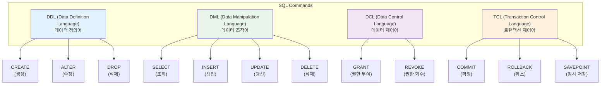

# 04_SQL 기본 및 역사

#SQL #데이터베이스 #database #RDBMS

---

## 🎯 학습 목표

- SQL의 역사와 특징을 이해하고, 실무에서 자주 사용되는 주요 개념을 파악합니다.
- DDL, DML, DCL, TCL 등 SQL 명령어의 종류와 역할을 구분합니다.

---

### SQL이란? (Structured Query Language)

- **비유**: 데이터베이스라는 "거대한 도서관"에서 원하는 책(데이터)을 찾거나, 새 책을 등록하고, 정보를 수정하기 위해 사용하는 "표준화된 요청 양식".
- **정의**: 관계형 데이터베이스(RDBMS)와 소통하기 위한 표준 언어. 데이터를 정의, 조작, 제어하는 역할을 합니다.
- **특징**:
  - **선언적 언어**: "무엇을" 원하는지만 명시하면, "어떻게" 가져올지는 DBMS가 알아서 최적화합니다. (vs 절차적 언어)
  - **표준화**: ANSI/ISO 표준이 있어 대부분의 RDBMS에서 거의 동일한 문법을 사용합니다. (일부 방언 존재)
  - **집합 기반**: 모든 데이터 처리는 개별 행이 아닌 '행의 집합(Set)'을 기준으로 이루어집니다.

#선언적언어 #declarative #집합기반 #setbased

---

### SQL 명령어의 종류

- **DDL (데이터 정의어)**: 테이블, 인덱스 등 데이터 구조를 정의. (예: `CREATE TABLE ...`)
- **DML (데이터 조작어)**: 데이터를 조회, 삽입, 수정, 삭제. (예: `SELECT * FROM ...`)
- **DCL (데이터 제어어)**: 사용자 접근 권한을 관리. (예: `GRANT SELECT ON ...`)
- **TCL (트랜잭션 제어어)**: 데이터 변경 사항을 확정하거나 되돌림. (예: `COMMIT;`)

#DDL #DML #DCL #TCL

---

### 실무에서 중요한 SQL 개념

- **JOIN**: 여러 테이블을 특정 조건(Key)으로 연결하여 하나의 결과 집합으로 만듭니다.
  - **INNER JOIN**: 양쪽 테이블에 모두 일치하는 데이터만 반환.
  - **OUTER JOIN (LEFT/RIGHT/FULL)**: 한쪽 테이블 기준으로 일치하지 않는 데이터도 `NULL`로 포함하여 반환.
- **Subquery (서브쿼리)**: SQL 문 안에 포함된 또 다른 SQL 문. `WHERE`, `FROM`, `SELECT` 절 등에서 사용되어 복잡한 조건을 처리합니다.
- **Window Function (윈도 함수)**: `OVER()` 절을 사용하여 행의 집합(파티션) 내에서 순위, 합계, 평균 등을 계산합니다. (예: `RANK() OVER (PARTITION BY ... ORDER BY ...)`). 분석 쿼리에 매우 유용합니다.
- **Index (인덱스)**: 책의 '찾아보기'처럼, 특정 컬럼의 데이터를 빠르게 찾을 수 있도록 도와주는 자료 구조. `SELECT` 성능을 크게 향상시키지만, `INSERT`/`UPDATE` 시에는 부하가 발생할 수 있습니다.
- **Transaction (트랜잭션)**: '모두 성공하거나 모두 실패해야 하는' 논리적인 작업 단위. `COMMIT`과 `ROLLBACK`으로 데이터의 일관성을 보장합니다. (ACID 원칙)

#JOIN #조인 #서브쿼리 #subquery #윈도함수 #windowfunction #인덱스 #index #트랜잭션 #transaction

---

### SQLD 자격증 준비 팁 (10일 완성)

- **1~3일차**: 'SQL 전문가 가이드' 1과목(데이터 모델링) 정독. 개념 위주로 빠르게 이해.
- **4~7일차**: 2과목(SQL 기본 및 활용) 집중. `JOIN`, 서브쿼리, `GROUP BY` 등 핵심 문법 예제를 직접 실행하며 익힙니다.
- **8~9일차**: 기출문제 풀이. 틀린 문제는 반드시 해당 개념을 다시 찾아보고 오답 노트를 만듭니다.
- **10일차**: 최종 오답 노트 복습 및 자주 틀리는 유형 재확인.

> SQLD는 특정 DBMS에 종속되지 않은 표준 SQL 지식을 묻기 때문에, 문법 자체의 이해가 가장 중요합니다.

#SQLD #자격증 #데이터분석
