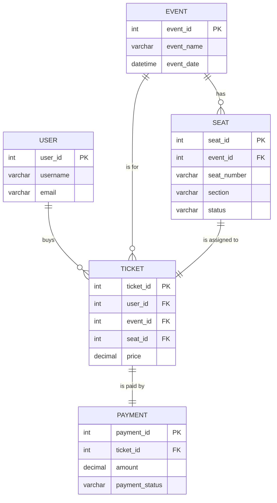

# 01*티켓*예매*시스템\_ERD*설계

#ERD #이알디 #데이터모델링 #datamodeling #티켓예매 #ticketing

---

## 🎯 학습 목표

- 티켓 예매 시스템의 요구사항을 분석하여 핵심 엔터티를 도출합니다.
- 엔터티 간의 관계(1:1, 1:N, N:M)를 정의하고, 외래 키(FK)를 설정하여 ERD를 완성합니다.
- 설계된 ERD를 바탕으로 실제 구현 시나리오를 구체화합니다.

---

### 1. 주요 엔터티 (Entities)

- **사용자 (User)**: 앱을 사용하는 주체.
  - `user_id` (PK): 사용자 고유 식별자 (기본 키).
    - **인조 키(Surrogate Key)**: 비즈니스 의미 없이 고유성을 위해 만들어진 키 (예: Auto-increment 숫자, UUID).
  - `username`, `email`, `password_hash`, `phone_number`
- **공연 (Event)**: 티켓을 판매하는 대상.
  - `event_id` (PK), `event_name`, `event_date`, `venue`, `description`
- **좌석 (Seat)**: 공연장 내의 개별 좌석.
  - `seat_id` (PK), `seat_number`, `section`
  - `event_id` (FK): 이 좌석이 속한 공연.
  - `status`: 좌석 상태 ('available', 'reserved', 'sold').
- **티켓 (Ticket)**: 사용자가 구매하는 최종 상품.
  - `ticket_id` (PK)
  - `user_id` (FK): 티켓을 구매한 사용자.
  - `event_id` (FK): 티켓에 해당하는 공연.
  - `seat_id` (FK): 티켓에 해당하는 좌석.
  - `purchase_date`, `price`
- **결제 (Payment)**: 티켓 구매에 대한 결제 정보.
  - `payment_id` (PK)
  - `ticket_id` (FK): 결제에 연결된 티켓.
  - `amount`, `payment_method`, `payment_status`

#기본키 #PK #primarykey #외래키 #FK #foreignkey #인조키 #surrogatekey

---

### 2. 관계 (Relationships)

> **FK를 어디에 두는가?** → 1:N 관계에서는 **N쪽(자식 테이블)**에 1쪽(부모 테이블)의 PK를 FK로 둡니다. 예를 들어, 한 명의 사용자는 여러 티켓을 가질 수 있으므로(`User` 1 : `Ticket` N), `Ticket` 테이블에 `user_id`를 FK로 추가합니다.

- **사용자 (User) 1 : N 티켓 (Ticket)**: 한 명의 사용자는 여러 티켓을 구매할 수 있습니다.
- **공연 (Event) 1 : N 좌석 (Seat)**: 하나의 공연에는 여러 좌석이 있습니다.
- **공연 (Event) 1 : N 티켓 (Ticket)**: 하나의 공연에 여러 티켓이 판매될 수 있습니다.
- **좌석 (Seat) 1 : 1 티켓 (Ticket)**: 하나의 좌석은 하나의 티켓에만 연결됩니다. (특정 공연의 특정 좌석)
- **티켓 (Ticket) 1 : 1 결제 (Payment)**: 하나의 티켓 구매에는 하나의 결제 정보가 발생합니다.

#일대다 #onetomany #일대일 #onetoone #관계설정

---

### 3. Mermaid로 시각화

#Mermaid #머메이드 #시각화 #visualization
