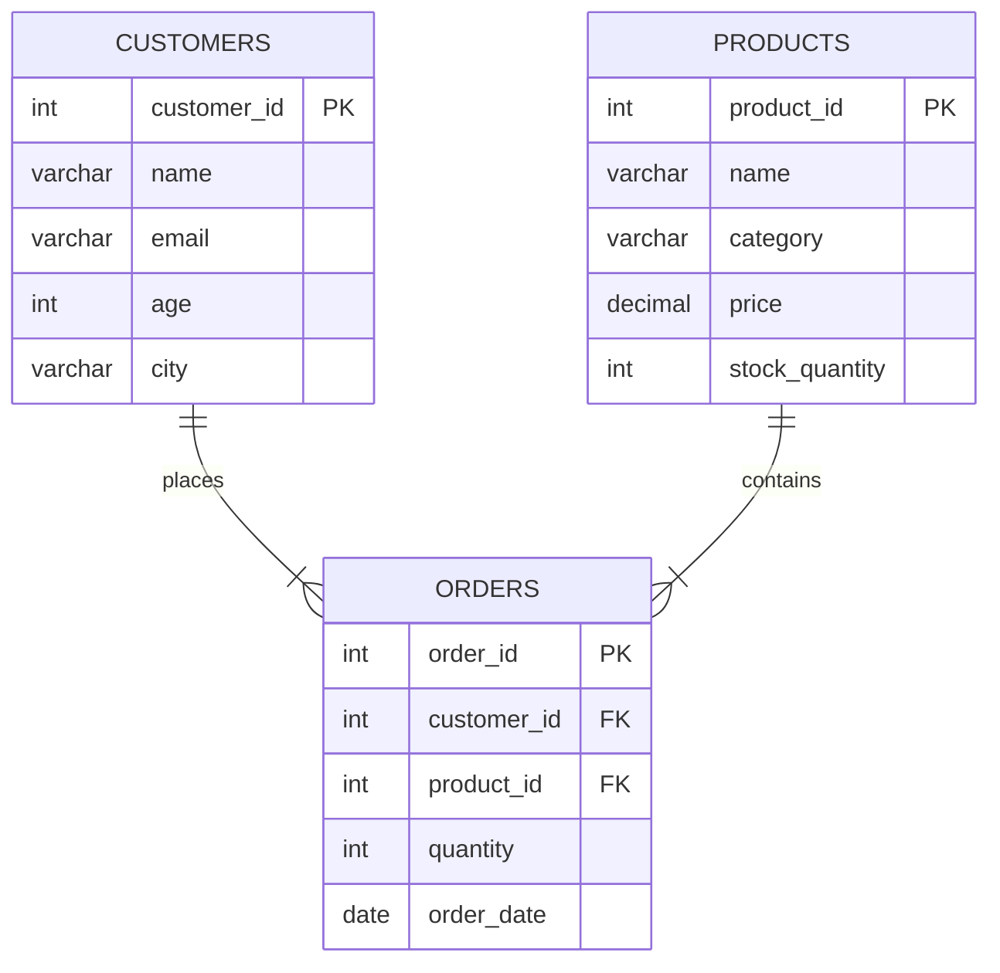

# 00*SQL*명령어*분류*및*연습*환경\_구축

#SQL #에스큐엘 #DQL #DML #DDL #데이터베이스

---

## 🎯 학습 목표

- DQL, DML, DDL의 차이점을 이해하고 각 명령어의 목적을 파악합니다.
- SQL 연습을 위한 샘플 테이블(Customers, Products, Orders)을 생성하고 초기 데이터를 삽입합니다.

---

### SQL 명령어 분류

| 분류    | 목적                             | 대표 명령                             | 기억법                 |
| :------ | :------------------------------- | :------------------------------------ | :--------------------- |
| **DQL** | 데이터 **조회**                  | `SELECT`                              | "**Q**uery: 읽기"      |
| **DML** | 데이터 **조작** (삽입·수정·삭제) | `INSERT`, `UPDATE`, `DELETE`          | "**M**anipulate: 쓰기" |
| **DDL** | 데이터 **정의** (스키마 변경)    | `CREATE`, `ALTER`, `DROP`, `TRUNCATE` | "**D**efine: 구조"     |

> **용어 구분**: 업계 관례상 `SELECT` 구문만을 따로 **DQL(Data Query Language)**로 명확히 구분하기도 합니다.

#DQL #DML #DDL #데이터조회 #데이터조작 #데이터정의

---

### 연습용 테이블 스키마 (ERD)



#ERD #Mermaid #머메이드 #스키마 #schema

---

### 1. 테이블 생성 (DDL: `CREATE TABLE`)

```sql
-- 고객 테이블
CREATE TABLE customers (
    customer_id INT PRIMARY KEY AUTO_INCREMENT,
    name VARCHAR(50) NOT NULL,
    email VARCHAR(100) NOT NULL UNIQUE,
    age INT,
    city VARCHAR(50) NOT NULL DEFAULT '서울',
    created_at TIMESTAMP DEFAULT CURRENT_TIMESTAMP()
);

-- 상품 테이블
CREATE TABLE products (
    product_id INT PRIMARY KEY AUTO_INCREMENT,
    name VARCHAR(100) NOT NULL,
    category VARCHAR(50),
    price DECIMAL(10, 2),
    stock_quantity INT DEFAULT 0
);

-- 주문 테이블
CREATE TABLE orders (
    order_id INT PRIMARY KEY AUTO_INCREMENT,
    customer_id INT,
    product_id INT,
    quantity INT,
    order_date DATE,
    total_amount DECIMAL(10,2),
    FOREIGN KEY (customer_id) REFERENCES customers(customer_id),
    FOREIGN KEY (product_id) REFERENCES products(product_id)
);
```

#DDL #CREATE #테이블생성 #제약조건 #constraints

---

### 2. 데이터 삽입 (DML: `INSERT INTO`)

```sql
-- 고객 데이터
INSERT INTO customers (name, email, age, city) VALUES
('김철수', 'kim@email.com', 25, '서울'),
('이영희', 'lee@email.com', 30, '부산'),
('박민수', 'park@email.com', 28, '대구'),
('최지영', 'choi@email.com', 22, '서울'),
('정하나', 'jung@email.com', 35, '인천');

-- 상품 데이터
INSERT INTO products (name, category, price, stock_quantity) VALUES
('iPhone 15', '전자제품', 1200000.00, 50),
('갤럭시 S24', '전자제품', 1000000.00, 30),
('MacBook Pro', '전자제품', 2500000.00, 20),
('나이키 운동화', '의류', 150000.00, 100),
('아디다스 가방', '액세서리', 80000.00, 75);

-- 주문 데이터
INSERT INTO orders (customer_id, product_id, quantity, order_date, total_amount) VALUES
(1, 1, 1, '2026-08-15', 1200000.00),
(2, 2, 1, '2026-08-16', 1000000.00),
(1, 4, 2, '2026-08-17', 300000.00),
(3, 3, 1, '2026-08-18', 2500000.00),
(4, 5, 1, '2026-08-19', 80000.00),
(2, 4, 1, '2026-08-20', 150000.00);
```

#DML #INSERT #데이터삽입
