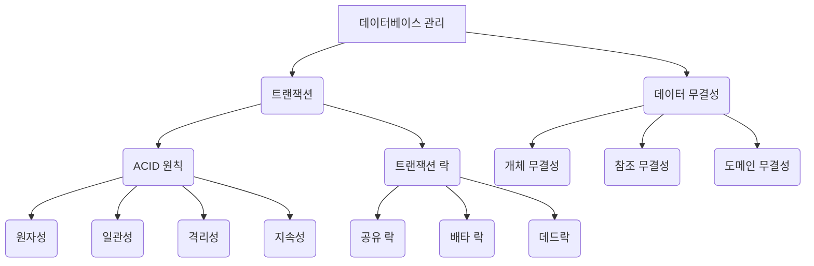
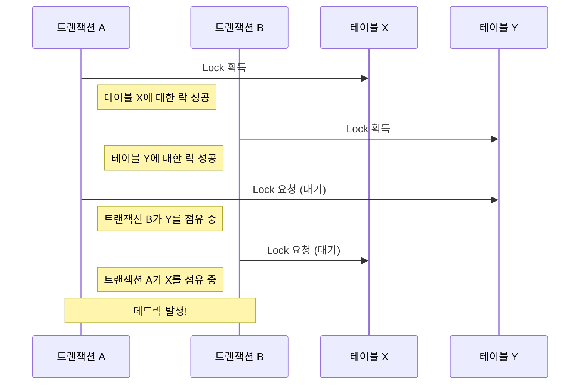

# 00. 트랜잭션 및 데이터 무결성

#데이터베이스 #database #트랜잭션 #transaction
#ACID #원자성 #일관성 #격리성 #지속성

이 문서에서는 데이터베이스의 핵심 개념인 트랜잭션(Transaction)과 데이터 무결성(Data Integrity)에 대해 알아봅니다. 이 두 가지는 데이터의 정확성과 일관성을 보장하는 데 필수적인 요소입니다.

---

## 🎯 학습 목표

- 트랜잭션의 개념과 ACID 원칙을 이해합니다.
- 데이터 무결성의 종류와 중요성을 파악합니다.
- 트랜잭션 락(Lock)의 개념과 데드락(Deadlock)에 대해 학습합니다.

---

## 📋 빠른 참조

| 용어 (Term)                        | 설명 (Description)                                                                                              |
| ---------------------------------- | --------------------------------------------------------------------------------------------------------------- |
| **트랜잭션 (Transaction)**         | 데이터베이스의 상태를 변화시키는 하나의 논리적 작업 단위. 전부 성공하거나 전부 실패해야 합니다.                 |
| **ACID**                           | 트랜잭션이 가져야 할 4가지 특성: 원자성(Atomicity), 일관성(Consistency), 격리성(Isolation), 지속성(Durability). |
| **데이터 무결성 (Data Integrity)** | 데이터베이스 내 데이터의 정확성, 일관성, 유효성을 유지하는 것.                                                  |
| **트랜잭션 락 (Lock)**             | 여러 트랜잭션이 동시에 같은 데이터에 접근할 때 데이터의 일관성을 지키기 위한 잠금 메커니즘.                     |
| **데드락 (Deadlock)**              | 두 개 이상의 트랜잭션이 서로 상대방의 락이 해제되기를 기다리며 무한 대기하는 상태.                              |

---

## 🗺️ 구성 개요



---

## 1. 트랜잭션 (Transaction)

#트랜잭션 #transaction

트랜잭션은 **데이터베이스의 상태를 변경하는 논리적인 작업 단위**입니다. 여러 개의 DML(INSERT, UPDATE, DELETE) 명령어가 하나의 트랜잭션으로 묶일 수 있습니다.

- **비유**: 은행에서 계좌 이체를 하는 상황을 생각해봅시다. A 계좌에서 돈을 인출하고 B 계좌로 입금하는 두 과정은 반드시 함께 성공하거나, 하나라도 실패하면 모두 취소되어야 합니다. 이 전체 과정을 하나의 '트랜잭션'으로 볼 수 있습니다.

MySQL에서는 기본적으로 `AUTOCOMMIT` 모드가 활성화되어 있어 모든 DML 문이 즉시 커밋(적용)됩니다. 트랜잭션을 직접 제어하려면 `START TRANSACTION;` 명령어로 시작합니다.

```sql
-- 트랜잭션 시작
START TRANSACTION;

-- 데이터 변경 작업 (예: 부서 전화번호 변경)
UPDATE department
SET office_tel='02-111-1111'
WHERE dept_id=11;

-- 변경된 내용 확인 (현재 트랜잭션 세션에서만 보임)
SELECT * FROM department WHERE dept_id=11;

-- 변경 사항을 되돌림 (트랜잭션 시작 이전 상태로)
ROLLBACK;
-- 또는 변경 사항을 최종 적용
-- COMMIT;

-- 롤백 후 데이터 확인 (원래 데이터로 돌아옴)
SELECT * FROM department WHERE dept_id=11;
```

### ACID 원칙

#ACID

트랜잭션은 안전한 데이터 처리를 위해 다음 네 가지 특성(ACID)을 만족해야 합니다.

1.  **원자성 (Atomicity)**

    - 트랜잭션의 모든 작업이 **전부 성공하거나 전부 실패**해야 합니다. 'All or Nothing'.
    - 계좌 이체 예시처럼, 인출만 성공하고 입금이 실패하는 경우는 없어야 합니다.

2.  **일관성 (Consistency)**

    - 트랜잭션이 성공적으로 완료되면 데이터베이스는 항상 **일관된 상태**를 유지해야 합니다.
    - 데이터베이스의 제약 조건(예: NOT NULL, UNIQUE, FOREIGN KEY)이 깨지지 않아야 합니다.

3.  **격리성 (Isolation)**

    - 여러 트랜잭션이 동시에 실행될 때, 각 트랜잭션은 **서로에게 영향을 주지 않고 독립적으로 실행**되는 것처럼 보여야 합니다.
    - 다른 사람이 계좌 이체를 하는 중이라고 해서 내 계좌 조회가 방해받아서는 안 됩니다. 이를 위해 '락(Lock)' 메커니즘이 사용됩니다.

4.  **지속성 (Durability)**
    - 성공적으로 완료된 트랜잭션의 결과는 시스템에 **영구적으로 저장**되어야 합니다.
    - `COMMIT`이 완료된 후에는 시스템 장애가 발생하더라도 데이터는 보존되어야 합니다.

---

## 2. 데이터 무결성 (Data Integrity)

#데이터무결성 #dataintegrity

데이터 무결성은 데이터베이스에 저장된 데이터가 항상 **정확하고 일관되며 유효한 상태**를 유지하는 것을 의미합니다.

- **개체 무결성 (Entity Integrity)**: 기본 키(Primary Key)는 `NULL` 값을 가질 수 없으며, 테이블 내에서 유일해야 합니다.
- **참조 무결성 (Referential Integrity)**: 외래 키(Foreign Key)는 참조하는 테이블의 기본 키 값 중 하나이거나 `NULL`이어야 합니다. 존재하지 않는 데이터를 참조할 수 없습니다.
- **도메인 무결성 (Domain Integrity)**: 컬럼에 저장되는 데이터는 정의된 데이터 타입, `NOT NULL`, `CHECK` 등의 제약 조건을 만족해야 합니다.

---

## 3. 트랜잭션 락 (Lock) 과 데드락 (Deadlock)

#락 #lock #데드락 #deadlock

### 트랜잭션 락 (Lock)

격리성을 보장하기 위해 데이터베이스는 락 메커니즘을 사용합니다. 특정 데이터에 대한 접근을 제어하여 동시성 문제를 해결합니다.

- **공유 락 (Shared Lock)**: 다른 트랜잭션이 해당 데이터를 **읽는 것(SELECT)은 허용**하지만, **쓰는 것(INSERT, UPDATE, DELETE)은 방지**합니다.
- **배타 락 (Exclusive Lock)**: 다른 트랜잭션이 해당 데이터를 **읽고 쓰는 것을 모두 방지**합니다. 데이터 변경 시 사용됩니다.

### 데드락 (Deadlock)

데드락은 두 개 이상의 트랜잭션이 서로 상대방이 점유한 락이 해제되기를 기다리면서 무한 대기 상태에 빠지는 현상입니다.

- **상황 예시**:
  1.  **트랜잭션 A**가 `테이블 X`의 락을 획득합니다.
  2.  **트랜잭션 B**가 `테이블 Y`의 락을 획득합니다.
  3.  **트랜잭션 A**가 `테이블 Y`의 락을 획득하려고 대기합니다. (트랜잭션 B가 락을 쥐고 있음)
  4.  **트랜잭션 B**가 `테이블 X`의 락을 획득하려고 대기합니다. (트랜잭션 A가 락을 쥐고 있음)

이 경우, 두 트랜잭션은 영원히 서로를 기다리게 됩니다. MySQL과 같은 대부분의 DBMS는 데드락을 감지하고, 둘 중 하나의 트랜잭션을 강제로 `ROLLBACK` 시켜 문제를 해결합니다.



---

## ✅ 요약

- **트랜잭션**은 데이터베이스 작업을 논리적 단위로 묶어 원자성, 일관성, 격리성, 지속성(ACID)을 보장합니다.
- **데이터 무결성**은 데이터의 정확성과 일관성을 지키는 규칙입니다.
- **락**은 동시성을 제어하여 데이터의 일관성을 유지하며, 잘못된 락 요청 순서는 **데드락**을 유발할 수 있습니다.
