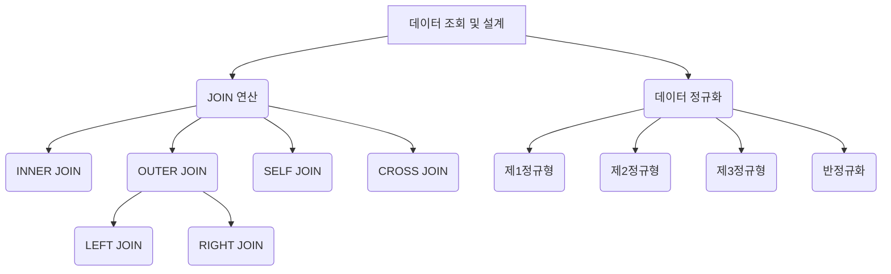

# 01. JOIN 과 정규화

#데이터베이스 #database
#JOIN #조인 #정규화 #normalization

이 문서에서는 여러 테이블에 흩어져 있는 데이터를 연결하여 조회하는 `JOIN` 연산과, 데이터의 중복을 최소화하고 구조를 효율적으로 설계하는 과정인 `정규화(Normalization)`에 대해 알아봅니다.

---

## 🎯 학습 목표

- 다양한 `JOIN`(INNER, OUTER, SELF, CROSS)의 종류와 사용법을 이해합니다.
- `JOIN` 조건절 `ON`과 `WHERE`의 차이를 파악합니다.
- 데이터 정규화의 개념과 필요성을 이해하고, 기본적인 정규형을 학습합니다.

---

## 📋 빠른 참조

| 용어 (Term)                    | 설명 (Description)                                                                                   |
| ------------------------------ | ---------------------------------------------------------------------------------------------------- |
| **JOIN**                       | 두 개 이상의 테이블을 특정 조건에 따라 연결하여 하나의 결과 집합으로 만드는 연산.                    |
| **INNER JOIN**                 | 두 테이블에 공통으로 존재하는 데이터만 결합합니다.                                                   |
| **OUTER JOIN (LEFT/RIGHT)**    | 한쪽 테이블의 모든 데이터를 포함하고, 다른 쪽 테이블에 매칭되는 데이터가 없으면 `NULL`로 표시합니다. |
| **SELF JOIN**                  | 하나의 테이블을 자기 자신과 조인하여 계층 구조 등을 표현합니다.                                      |
| **정규화 (Normalization)**     | 데이터의 중복을 줄이고 일관성을 높이기 위해 테이블을 분리하는 과정.                                  |
| **반정규화 (Denormalization)** | 조회 성능 향상을 위해 의도적으로 정규화 원칙을 위배하여 중복을 허용하는 것.                          |

---

## 🗺️ 구성 개요



---

## 1. JOIN 이란?

#JOIN #조인 #조인

`JOIN`은 관계형 데이터베이스의 핵심 기능으로, **두 개 이상의 테이블을 공통된 컬럼(주로 PK-FK 관계)을 기준으로 연결**하여 데이터를 조회하는 방법입니다. 정규화를 통해 분리된 테이블들을 다시 합쳐 의미 있는 데이터를 만드는 데 사용됩니다.

- **비유**: 학생 정보가 담긴 `학생` 테이블과 학과 정보가 담긴 `학과` 테이블이 있다고 상상해봅시다. 각 학생이 어떤 학과에 속하는지 알려면, 두 테이블을 '학과 코드'라는 공통 정보로 연결해야 합니다. 이 연결 과정이 바로 `JOIN`입니다.

### `ON` vs `WHERE`

- `ON` 절은 `JOIN`할 테이블을 어떻게 연결할지 **연결 조건**을 정의합니다. `FROM` 절의 일부로 처리되어 `WHERE` 절보다 먼저 실행됩니다.
- `WHERE` 절은 `JOIN`이 완료된 후 생성된 결과 집합에서 **필터링 조건**을 정의합니다.

> **💡 성능 팁** > `ON` 절에 조건을 명시하면 `JOIN` 대상이 되는 행의 수를 미리 줄일 수 있어 `WHERE` 절에서 필터링하는 것보다 일반적으로 성능에 유리합니다.

---

## 2. JOIN의 종류

### INNER JOIN

- **가장 일반적인 조인 방식**으로, 두 테이블의 조인 조건이 일치하는 행만 결과에 포함됩니다.
- **예시**: 부서에 소속된 직원 목록 조회 (부서가 없는 직원은 제외됨)

```sql
-- 직원(employees)과 부서(departments) 테이블을 dept_id 기준으로 조인
SELECT e.name, d.dept_name
FROM employees AS e
INNER JOIN departments AS d ON e.dept_id = d.dept_id;
```

### OUTER JOIN (LEFT / RIGHT)

- 한쪽 테이블의 모든 행을 포함하고, 다른 쪽 테이블에 매칭되는 데이터가 없는 경우 `NULL`로 표시합니다.
- **LEFT JOIN**: 왼쪽 테이블(FROM 절에 먼저 명시된 테이블)의 모든 행을 포함합니다.
- **RIGHT JOIN**: 오른쪽 테이블의 모든 행을 포함합니다.

```sql
-- LEFT JOIN: 직원이 없는 부서도 모두 조회
SELECT d.dept_name, e.name
FROM departments d
LEFT JOIN employees e ON d.dept_id = e.dept_id;
```

- **실전 용도**: "아직 한 번도 주문하지 않은 고객 찾기", "직원이 배정되지 않은 부서 찾기" 등 특정 데이터가 없는 경우를 찾을 때 유용합니다.

### SELF JOIN

- **하나의 테이블을 자기 자신과 조인**하는 방식입니다. 테이블에 별칭(Alias)을 붙여 두 개의 다른 테이블처럼 사용합니다.
- **예시**: 직원의 이름과 그 직원의 관리자 이름을 함께 조회 (계층 구조 표현)

```sql
-- employees 테이블을 관리자(m)와 직원(s)으로 별칭을 주어 조인
SELECT s.name AS staff_name, m.name AS manager_name
FROM employees s
JOIN employees m ON s.manager_id = m.emp_id;
```

### CROSS JOIN

- 두 테이블의 모든 가능한 조합을 생성합니다 (카테시안 곱). `ON` 조건절이 없습니다.
- **주의**: 데이터 양이 기하급수적으로 늘어날 수 있어 신중하게 사용해야 합니다.
- **실전 용도**: 특정 기간의 모든 날짜와 모든 제품을 조합하여 일별 재고 테이블을 생성하는 등 특정 목적에 사용됩니다.

---

## 3. 데이터 정규화 (Normalization)

#정규화 #normalization #노멀라이제이션

정규화는 **데이터의 중복을 최소화하고, 데이터의 일관성과 무결성을 확보**하기 위해 테이블을 논리적으로 분리하는 과정입니다.

- **비유**: 잘 정리된 서랍장과 같습니다. 옷 종류별(티셔츠, 바지 등)로 서랍을 나누면 옷을 찾기 쉽고, 같은 옷을 여러 곳에 둘 필요가 없어집니다. 여기서 서랍이 '테이블', 옷이 '데이터'입니다.

### 주요 정규형

- **제1정규형 (1NF)**: 테이블의 모든 컬럼 값이 **원자값(Atomic Value)**이어야 합니다. 즉, 하나의 컬럼에 여러 값을 리스트 형태로 가질 수 없습니다.

  - `[자바, 파이썬]`과 같은 값은 허용되지 않습니다.

- **제2정규형 (2NF)**: 제1정규형을 만족하고, **부분 함수 종속을 제거**해야 합니다. 기본 키가 복합 키일 때, 키의 일부에만 종속되는 컬럼이 없어야 합니다.

  - `(학생 ID, 과목 ID)`가 기본 키일 때, `과목명`은 `과목 ID`에만 종속되므로 별도의 `과목` 테이블로 분리해야 합니다.

- **제3정규형 (3NF)**: 제2정규형을 만족하고, **이행 함수 종속을 제거**해야 합니다. 기본 키가 아닌 컬럼이 다른 일반 컬럼에 종속되는 경우가 없어야 합니다.
  - `학생` 테이블에 `학과명`과 `학과사무실_전화번호`가 있을 때, `학과사무실_전화번호`는 `학과명`에 종속되므로 별도의 `학과` 테이블로 분리해야 합니다.

> **💡 실무 관점**
> 일반적으로 **제3정규형**까지 만족하도록 데이터베이스를 설계합니다. `AUTO_INCREMENT`와 같은 인조 키(Surrogate Key)를 기본 키로 사용하면 대부분의 정규화 문제를 자연스럽게 해결할 수 있습니다.

### 반정규화 (Denormalization)

조회 성능을 높이기 위해 의도적으로 정규화 원칙을 위배하여 테이블에 데이터를 중복 저장하거나, 테이블을 병합하는 것을 의미합니다. `JOIN` 연산을 줄여 조회 속도를 높일 수 있지만, 데이터 불일치가 발생할 수 있어 신중한 접근이 필요합니다.

---

## ✅ 요약

- `JOIN`은 분리된 테이블을 연결하여 풍부한 정보를 조회하는 강력한 도구입니다.
- `INNER JOIN`은 공통된 데이터, `OUTER JOIN`은 한쪽 기준의 모든 데이터, `SELF JOIN`은 계층 구조를 표현하는 데 사용됩니다.
- **정규화**는 데이터 중복을 줄여 데이터베이스를 효율적으로 관리하는 설계 원칙이며, **반정규화**는 성능을 위해 의도적으로 이를 위배하는 전략입니다.
