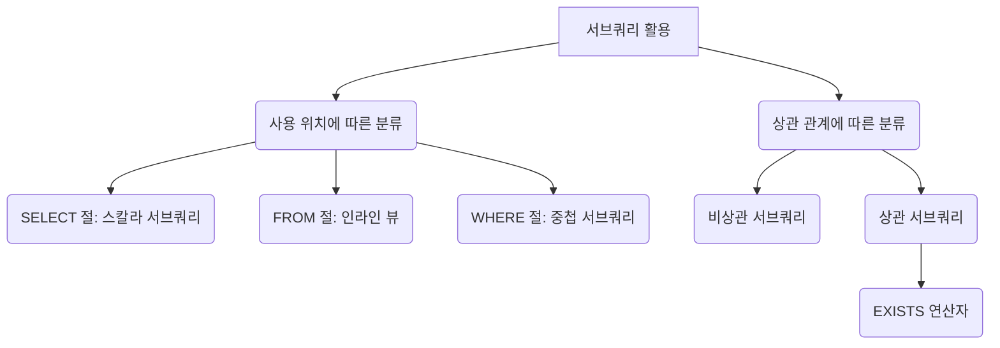

# 02. 서브쿼리 (Subquery)

#데이터베이스 #database #데이터베이스 #서브쿼리 #subquery #서브쿼리

이 문서에서는 SQL 쿼리 안에 포함된 또 다른 `SELECT` 문인 **서브쿼리(Subquery)**에 대해 알아봅니다. 서브쿼리는 복잡한 데이터를 조회하고, 다른 쿼리의 결과를 조건으로 사용하거나, 즉석에서 테이블을 만들어 사용하는 등 다양한 활용이 가능합니다.

---

## 🎯 학습 목표

- 서브쿼리의 개념과 동작 방식을 이해합니다.
- 서브쿼리가 사용되는 위치(`SELECT`, `FROM`, `WHERE`)에 따른 종류와 특징을 학습합니다.
- 상관 서브쿼리와 비상관 서브쿼리의 차이점을 파악합니다.
- `EXISTS` 연산자를 활용하여 효율적인 서브쿼리를 작성하는 방법을 배웁니다.

---

## 📋 빠른 참조

| 용어 (Term)                             | 설명 (Description)                                                            |
| --------------------------------------- | ----------------------------------------------------------------------------- |
| **서브쿼리 (Subquery)**                 | 다른 SQL 쿼리 내부에 중첩된 `SELECT` 문. 내부 쿼리(Inner Query)라고도 합니다. |
| **스칼라 서브쿼리 (Scalar Subquery)**   | `SELECT` 절에서 사용되며, 단일 행, 단일 열의 값을 반환합니다.                 |
| **인라인 뷰 (Inline View)**             | `FROM` 절에서 사용되며, 서브쿼리의 결과를 하나의 가상 테이블처럼 사용합니다.  |
| **중첩 서브쿼리 (Nested Subquery)**     | `WHERE` 절에서 사용되며, 외부 쿼리의 조건으로 활용됩니다.                     |
| **상관 서브쿼리 (Correlated Subquery)** | 외부 쿼리의 컬럼을 참조하여, 외부 쿼리의 각 행에 대해 반복적으로 실행됩니다.  |
| **EXISTS**                              | 서브쿼리의 결과가 하나 이상 존재하면 `TRUE`를 반환하는 연산자.                |

---

## 🗺️ 구성 개요



---

## 1. 서브쿼리란?

서브쿼리는 **하나의 SQL 쿼리 안에 포함된 또 다른 `SELECT` 문**입니다. 바깥쪽 쿼리를 메인 쿼리(Main Query) 또는 외부 쿼리(Outer Query)라고 부릅니다. 서브쿼리는 괄호 `()`로 감싸야 합니다.

- **비유**: "서울에 있는 부서의 직원들을 찾아줘"라는 요청을 처리하는 과정과 같습니다.
  1.  먼저 "서울에 있는 부서"가 무엇인지 찾습니다. (이것이 서브쿼리)
  2.  그다음, 찾은 부서에 속한 직원들을 조회합니다. (이것이 메인 쿼리)

---

## 2. 사용 위치에 따른 서브쿼리 종류

### ① 스칼라 서브쿼리 (Scalar Subquery) - `SELECT` 절

- **단일 값(하나의 행, 하나의 열)을 반환**하는 서브쿼리로, `SELECT` 절에서 하나의 컬럼처럼 사용됩니다.
- `JOIN`으로 처리할 수도 있지만, 간단한 값을 가져올 때 유용합니다.

```sql
-- 각 직원의 이름과 함께 해당 직원이 속한 부서의 이름을 조회
SELECT
    e.name,
    (SELECT d.dept_name FROM departments d WHERE d.dept_id = e.dept_id) AS department_name
FROM
    employees e;
```

### ② 인라인 뷰 (Inline View) - `FROM` 절

- `FROM` 절에서 사용되며, **서브쿼리의 결과 집합을 하나의 임시 테이블(가상 테이블)**처럼 사용합니다.
- 반드시 별칭(Alias)을 지정해야 합니다.

```sql
-- 2025년 1월 1일 이후에 고용된 직원들 중에서, 부서별 직원 수를 집계
SELECT
    t.dept_id,
    COUNT(*) AS employee_count
FROM
    (SELECT dept_id FROM employees WHERE hire_date >= '2025-01-01') AS t
GROUP BY
    t.dept_id;
```

### ③ 중첩 서브쿼리 (Nested Subquery) - `WHERE` 절

- `WHERE` 절에서 조건의 일부로 사용되며, 비교 연산자(`=`, `>`, `<`)나 `IN`, `ANY`, `ALL` 등과 함께 쓰입니다.
- 서브쿼리의 결과에 따라 메인 쿼리가 조회할 행이 결정됩니다.

```sql
-- 'Sales' 부서에 속한 모든 직원의 정보를 조회
SELECT *
FROM employees
WHERE dept_id IN (SELECT dept_id FROM departments WHERE dept_name = 'Sales');
```

---

## 3. 상관 관계에 따른 서브쿼리 종류

### ① 비상관 서브쿼리 (Non-correlated Subquery)

- **외부 쿼리와 독립적으로 실행**되는 서브쿼리입니다.
- 서브쿼리가 먼저 한 번 실행된 후, 그 결과를 외부 쿼리에 전달하여 사용합니다. 위에서 본 대부분의 예시가 여기에 해당합니다.

### ② 상관 서브쿼리 (Correlated Subquery)

- **서브쿼리가 외부 쿼리의 컬럼을 참조**하는 경우입니다.
- 외부 쿼리의 각 행이 처리될 때마다 서브쿼리가 반복적으로 실행됩니다.
- **주의**: 행마다 반복 실행되므로 데이터 양이 많을 경우 성능 저하의 원인이 될 수 있습니다. `JOIN`이나 `EXISTS`로 대체 가능한지 검토하는 것이 좋습니다.

```sql
-- 자신이 속한 부서의 평균 급여보다 더 많은 급여를 받는 직원들을 조회
SELECT
    e.emp_id,
    e.name,
    e.salary
FROM
    employees e
WHERE
    e.salary > (SELECT AVG(salary) FROM employees WHERE dept_id = e.dept_id);
    -- 외부 쿼리의 e.dept_id를 참조하여, 각 직원의 부서별로 평균 급여를 계산
```

---

## 4. EXISTS 연산자

#EXISTS #이그지스트

`EXISTS`는 **서브쿼리의 결과 집합에 행이 하나 이상 존재하면 `TRUE`를, 존재하지 않으면 `FALSE`를 반환**하는 연산자입니다.

- `IN`과 달리 데이터 값을 비교하는 것이 아니라, **존재 여부만 확인**하므로 대량의 데이터에서 더 효율적일 수 있습니다.
- 주로 상관 서브쿼리와 함께 사용됩니다.

```sql
-- 한 번이라도 검색 기록이 있는 사용자 목록을 조회
SELECT u.email
FROM app_user u
WHERE EXISTS (
    SELECT 1 FROM search_log sl WHERE sl.user_id = u.user_id
);
```

- `NOT EXISTS`를 사용하면 "한 번도 페이지를 본 적 없는 사용자"와 같이 특정 조건을 만족하는 데이터가 없는 경우를 쉽게 찾을 수 있습니다.

```sql
-- 직원이 한 명도 없는 부서를 조회
SELECT d.dept_name
FROM departments d
WHERE NOT EXISTS (
    SELECT 1 FROM employees e WHERE e.dept_id = d.dept_id
);
```

---

## ✅ 요약

- **서브쿼리**는 SQL 쿼리 내의 또 다른 `SELECT` 문으로, 복잡한 조회를 간결하게 만들어줍니다.
- `SELECT` 절에서는 **스칼라 서브쿼리**, `FROM` 절에서는 **인라인 뷰**, `WHERE` 절에서는 **중첩 서브쿼리**로 사용됩니다.
- **상관 서브쿼리**는 외부 쿼리의 행마다 실행되어 성능에 영향을 줄 수 있으므로 주의해야 합니다.
- **EXISTS**는 데이터의 존재 여부만 확인하여, 특히 대량 데이터에서 `IN`보다 효율적인 경우가 많습니다.
