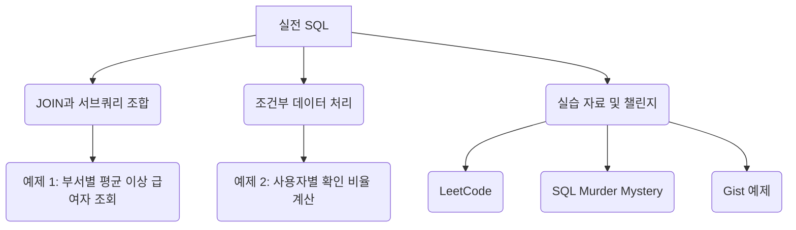

# 03. 실전 SQL 예제

#데이터베이스 #database
#SQL #실전예제 #SQL실습

이 문서에서는 앞에서 배운 `JOIN`과 `서브쿼리`를 조합하여 실제 업무에서 마주할 수 있는 복잡한 문제를 해결하는 예제들을 다룹니다. 또한, 문제 해결 능력을 키울 수 있는 유용한 학습 자료를 소개합니다.

---

## 🎯 학습 목표

- `JOIN`과 `서브쿼리`를 함께 사용하여 복잡한 데이터 조회 쿼리를 작성할 수 있습니다.
- `CASE` 문을 활용하여 조건에 따라 데이터를 동적으로 가공할 수 있습니다.
- LeetCode, SQL Murder Mystery 등 다양한 플랫폼을 통해 SQL 실력을 향상시키는 방법을 알아봅니다.

---

## 📋 빠른 참조

| 구문 (Syntax)              | 설명 (Description)                                                                          |
| -------------------------- | ------------------------------------------------------------------------------------------- |
| **`JOIN` + `Subquery`**    | `JOIN`으로 테이블을 연결하고, `서브쿼리`로 복잡한 조건을 설정하거나 조회 대상을 한정합니다. |
| **`CASE WHEN ... END`**    | `IF-THEN-ELSE`와 유사한 조건부 로직을 SQL 쿼리 내에서 구현합니다.                           |
| **`GROUP_CONCAT()`**       | `GROUP BY`로 그룹화된 결과에서 특정 컬럼의 값들을 하나의 문자열로 합칩니다.                 |
| **`ROUND(value, digits)`** | 숫자를 지정된 자릿수까지 반올림합니다.                                                      |
| **`AVG()`**                | 평균값을 계산하는 집계 함수입니다.                                                          |

---

## 🗺️ 구성 개요



---

## 1. JOIN과 서브쿼리 조합 예제

### 문제: "2025년 신규 입사자 중, 자신이 속한 부서의 신규 입사자 평균 급여보다 많이 받는 직원"을 조회하세요.

이 문제는 여러 단계의 분석이 필요합니다.

1.  **1단계**: 2025년 신규 입사자를 필터링해야 합니다. (`WHERE`)
2.  **2단계**: 직원 정보와 부서명을 함께 봐야 하므로 `JOIN`이 필요합니다.
3.  **3단계**: 각 부서별로 '신규 입사자'의 평균 급여를 계산해야 합니다. (상관 서브쿼리)
4.  **4단계**: 직원의 급여가 3단계에서 계산된 평균 급여보다 높은지 비교해야 합니다. (`WHERE`)

```sql
SELECT
    e.emp_id,
    e.name,
    d.dept_name,
    e.salary
FROM
    employees e
JOIN
    departments d ON d.dept_id = e.dept_id
WHERE
    e.hire_date >= '2025-01-01'  -- 1단계: 신규 입사자 필터링
AND
    e.salary > (
        -- 3단계: 부서별 신규 입사자 평균 급여 계산 (상관 서브쿼리)
        SELECT AVG(salary)
        FROM employees
        WHERE dept_id = e.dept_id  -- 외부 쿼리의 부서 ID 참조
          AND hire_date >= '2025-01-01'
    );
```

**쿼리 실행 흐름:**

- `FROM`과 `JOIN`을 통해 `employees`와 `departments` 테이블이 합쳐집니다.
- `WHERE e.hire_date >= '2025-01-01'` 조건으로 2025년 입사자만 남습니다.
- 남은 각 직원(행)에 대해, 상관 서브쿼리가 실행됩니다.
- 서브쿼리는 해당 직원의 부서 ID(`e.dept_id`)를 받아, 그 부서의 2025년 입사자 평균 급여를 계산하여 반환합니다.
- 직원의 급여(`e.salary`)가 서브쿼리가 반환한 평균값보다 크면 최종 결과에 포함됩니다.

---

## 2. `CASE` 문 활용 예제

### 문제: 사용자별 가입 확인(confirmation) 비율을 계산하세요. (LeetCode 문제 변형)

`Signups` 테이블에는 사용자 ID와 가입 시각이, `Confirmations` 테이블에는 사용자 ID와 확인 상태(`'confirmed'`, `'timeout'`)가 기록되어 있습니다.

**요구사항**: 각 사용자별로 `confirmed` 비율을 소수점 둘째 자리까지 반올림하여 계산하세요.

```sql
SELECT
    s.user_id,
    -- 2단계: 'confirmed'일 때 1, 아닐 때 0으로 변환 후 평균을 내어 비율 계산, 반올림
    ROUND(
        AVG(CASE WHEN c.action = 'confirmed' THEN 1 ELSE 0 END),
        2
    ) AS confirmation_rate
FROM
    Signups s
LEFT JOIN
    Confirmations c ON s.user_id = c.user_id -- 1단계: 가입한 모든 사용자를 기준으로 JOIN
GROUP BY
    s.user_id; -- 3단계: 사용자별로 그룹화
```

**쿼리 분석:**

- `LEFT JOIN`: 가입은 했지만 확인 기록이 전혀 없는 사용자도 결과에 포함시키기 위해 사용합니다.
- `CASE WHEN c.action = 'confirmed' THEN 1 ELSE 0 END`: `action`이 `'confirmed'`이면 1, 아니면 0을 반환합니다.
- `AVG(...)`: `1`과 `0`의 평균을 구하면 자연스럽게 `confirmed`의 비율이 계산됩니다. 예를 들어, 5번의 시도 중 3번이 `confirmed`라면 `(1+1+1+0+0)/5 = 0.6`이 됩니다.
- `ROUND(..., 2)`: 계산된 비율을 소수점 둘째 자리까지 반올림합니다.
- `GROUP BY s.user_id`: 사용자별로 비율을 계산하기 위해 그룹화합니다.

---

## 3. SQL 실력 향상을 위한 자료

다양한 문제를 풀어보며 SQL 활용 능력을 키우는 것이 중요합니다.

- **LeetCode - Top SQL 50**

  - 링크: <https://leetcode.com/studyplan/top-sql-50/>
  - 세계적인 개발자들이 푸는 알고리즘 문제 사이트로, SQL 문제도 다수 제공합니다. 특히 'Top SQL 50'은 필수적인 SQL 문제들을 모아놓은 좋은 학습 계획입니다.

- **SQL Murder Mystery**

  - 링크: <https://mystery.knightlab.com/walkthrough.html>
  - 살인 사건의 범인을 SQL 쿼리를 통해 찾아가는 흥미로운 게임 형식의 튜토리얼입니다. 재미있게 SQL을 연습할 수 있습니다.

- **Gist 예제 코드**
  - 실습용 데이터 및 쿼리:
    - <https://gist.github.com/notlikelion/653de937c621ae930ea3bd652b4e3521>
    - <https://gist.github.com/notlikelion/e2c654b716a8b4e8cbafd21f27d163ed>
  - 수업 및 실습에서 사용된 다양한 SQL 예제들을 참고하여 복습할 수 있습니다.

---

## ✅ 요약

- `JOIN`과 `서브쿼리`를 조합하면 다단계의 복잡한 비즈니스 로직도 하나의 쿼리로 해결할 수 있습니다.
- `CASE` 문은 쿼리 내에서 조건부 로직을 구현하여 데이터를 유연하게 가공하는 데 필수적입니다.
- 꾸준한 문제 풀이와 실습이 SQL 실력 향상의 지름길입니다. LeetCode와 같은 플랫폼을 적극적으로 활용하세요.
