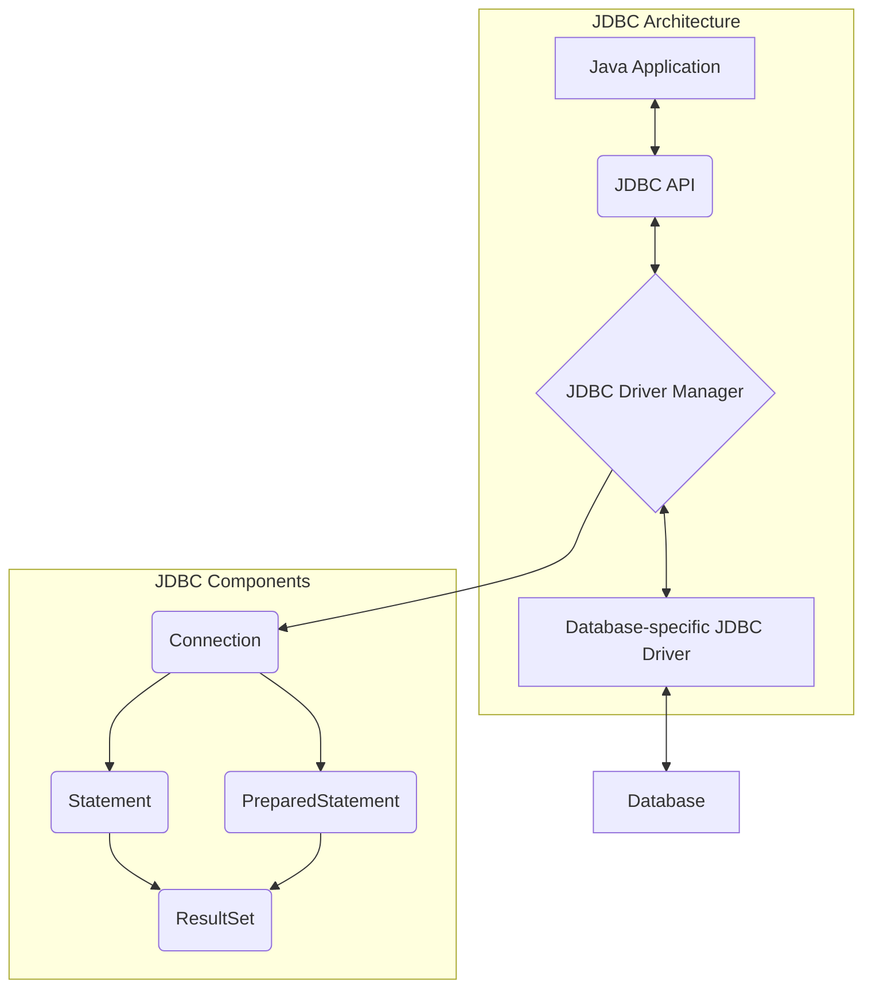

# 00. JDBC 개요 및 핵심 구성요소

#Java #자바
#JDBC #JavaDatabaseConnectivity #제이디비씨 #데이터베이스 #database

이 문서에서는 Java 애플리케이션이 데이터베이스와 통신할 수 있도록 해주는 표준 API인 **JDBC(Java Database Connectivity)**의 기본 개념과 핵심 구성요소에 대해 알아봅니다.

---

## 🎯 학습 목표

- JDBC의 정의와 아키텍처를 이해합니다.
- JDBC의 주요 구성요소(`DriverManager`, `Connection`, `Statement`, `PreparedStatement`, `ResultSet`)의 역할을 파악합니다.
- SQL 인젝션(SQL Injection) 공격의 위험성을 이해하고, `PreparedStatement`를 사용한 방어 전략을 학습합니다.

---

## 📋 빠른 참조

| 구성요소 (Component)  | 역할 (Description)                                                                                             |
| --------------------- | -------------------------------------------------------------------------------------------------------------- |
| **JDBC**              | Java 애플리케이션이 다양한 종류의 관계형 데이터베이스(RDBMS)와 표준화된 방식으로 통신하도록 정의한 명세(스펙). |
| **DriverManager**     | JDBC 드라이버를 관리하고, 데이터베이스와의 첫 연결(`Connection`)을 생성하는 팩토리 클래스.                     |
| **Connection**        | 데이터베이스와의 연결 세션을 나타내는 객체. 트랜잭션 관리, `Statement` 생성 등의 기능을 제공.                  |
| **Statement**         | SQL 문을 실행하기 위한 객체. SQL 문자열을 그대로 실행하여 SQL 인젝션에 취약.                                   |
| **PreparedStatement** | SQL 문을 미리 컴파일하고, 파라미터를 안전하게 바인딩하는 객체. SQL 인젝션을 방지하고 성능을 향상시킴.          |
| **ResultSet**         | `SELECT` 쿼리의 결과를 담는 객체. 커서(cursor)를 통해 데이터를 한 행씩 탐색.                                   |
| **SQL Injection**     | 사용자 입력값이 악의적인 SQL 코드로 해석되어 데이터베이스를 공격하는 기법.                                     |

---

## 🗺️ 구성 개요



---

## 1. JDBC란?

#JDBC #JavaDatabaseConnectivity #제이디비씨

JDBC는 **Java Database Connectivity**의 약자로, Java 애플리케이션이 데이터베이스와 통신하기 위한 **표준 인터페이스(API)**입니다. JDBC는 데이터베이스 벤더(MySQL, Oracle, PostgreSQL 등)가 제공하는 드라이버를 통해 실제 데이터베이스와의 통신을 처리합니다.

- **비유**: JDBC는 '어댑터'와 같습니다. 전 세계의 다양한 전기 콘센트(데이터베이스)에 노트북(Java 애플리케이션)을 연결하려면 각 나라에 맞는 어댑터(JDBC 드라이버)가 필요합니다. JDBC API라는 표준 덕분에 우리는 어댑터만 교체하면 어떤 콘센트에서든 노트북을 사용할 수 있습니다.

**JDBC 아키텍처**:
`Application` ↔ `JDBC API` ↔ `JDBC Driver` ↔ `Database`

이 구조 덕분에 개발자는 데이터베이스가 MySQL이든 PostgreSQL이든 상관없이 동일한 Java 코드로 데이터베이스 작업을 수행할 수 있습니다.

---

## 2. JDBC 핵심 구성요소

### `Statement` vs `PreparedStatement`

JDBC에서 SQL을 실행하는 두 가지 주요 인터페이스입니다. 둘의 차이점을 이해하는 것은 매우 중요합니다.

| 구분          | `Statement`                                              | `PreparedStatement`                                                                |
| ------------- | -------------------------------------------------------- | ---------------------------------------------------------------------------------- |
| **실행 방식** | SQL 문을 문자열로 받아 그대로 실행                       | `?` 플레이스홀더가 포함된 SQL 템플릿을 미리 컴파일                                 |
| **성능**      | 매번 실행 시마다 SQL 파싱, 컴파일, 실행 계획 수립        | 최초 한 번만 컴파일 후 캐싱, 이후에는 파라미터만 전달하여 재사용. **더 빠름**.     |
| **보안**      | SQL 문자열을 직접 조합하므로 **SQL 인젝션에 매우 취약**. | 파라미터가 SQL 문법이 아닌 '값'으로만 처리되므로 **SQL 인젝션을 원천적으로 방어**. |
| **가독성**    | SQL 문과 변수가 섞여 복잡함.                             | SQL 템플릿과 파라미터 바인딩 코드가 분리되어 깔끔함.                               |

> **결론: 항상 `PreparedStatement`를 사용해야 합니다.**

---

## 3. SQL 인젝션 (SQL Injection)

#SQL인젝션 #SQLInjection #에스큐엘인젝션

SQL 인젝션은 악의적인 사용자가 입력값에 SQL 코드를 삽입하여 데이터베이스를 비정상적으로 조작하는 공격 기법입니다. 인증을 우회하거나, 데이터를 유출/변조/삭제할 수 있는 심각한 보안 취약점입니다.

### `Statement`를 사용한 취약한 코드 예시

```java
// 사용자가 username에 'admin'--, password에 아무거나 입력하면?
String username = "admin'--"; // '--'는 SQL에서 주석을 의미
String password = "any-password";

String sql = "SELECT * FROM users WHERE username='" + username + "' AND password='" + password + "'";
// 완성된 SQL: SELECT * FROM users WHERE username='admin'--' AND password='...'
// '--' 뒤가 모두 주석 처리되어 비밀번호 검증 로직이 무시됨!

Statement stmt = connection.createStatement();
ResultSet rs = stmt.executeQuery(sql); // 로그인 성공!
```

### `PreparedStatement`를 사용한 안전한 코드

```java
String sql = "SELECT * FROM users WHERE username = ? AND password = ?";

PreparedStatement pstmt = connection.prepareStatement(sql);
pstmt.setString(1, username); // 첫 번째 ?에 username 값을 바인딩
pstmt.setString(2, password); // 두 번째 ?에 password 값을 바인딩

ResultSet rs = pstmt.executeQuery(); // 입력값은 문법이 아닌 데이터로만 처리됨
```

`PreparedStatement`는 `?`에 들어온 입력값을 단순한 문자열 데이터로 취급하므로, `admin'--` 같은 입력이 들어와도 SQL 문법으로 해석되지 않아 공격이 실패합니다.

---

## ✅ 요약

- **JDBC**는 Java와 데이터베이스를 연결하는 표준 API입니다.
- `Connection`, `Statement`, `PreparedStatement`, `ResultSet` 등이 핵심 구성요소입니다.
- **SQL 인젝션**은 심각한 보안 위협이며, 이를 방지하기 위해 반드시 **`PreparedStatement`**를 사용해야 합니다.
- `PreparedStatement`는 보안뿐만 아니라 성능 면에서도 `Statement`보다 우수합니다.
