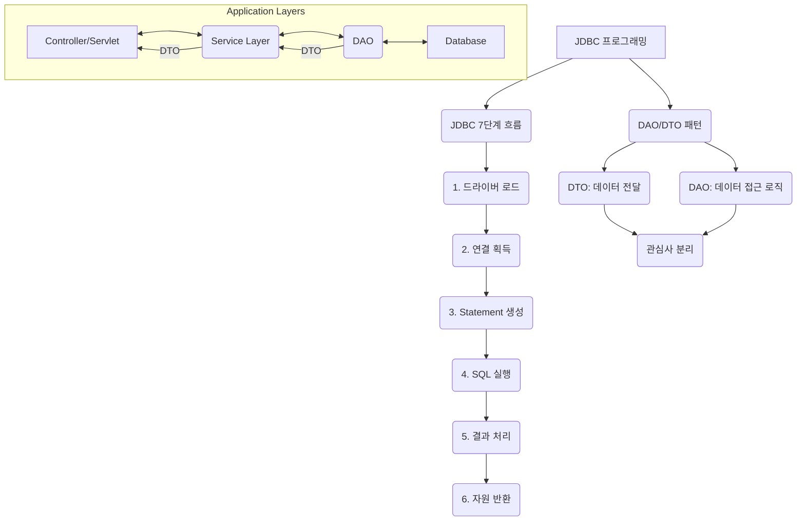

# 01. JDBC 프로그래밍 흐름과 DAO/DTO 패턴

#Java #자바
#JDBC #DAO #DTO #디자인패턴

이 문서에서는 표준적인 JDBC 프로그래밍의 7단계 흐름과, 데이터베이스 연동 코드를 체계적으로 관리하기 위한 **DAO(Data Access Object)** 및 **DTO(Data Transfer Object)** 디자인 패턴에 대해 알아봅니다.

---

## 🎯 학습 목표

- JDBC를 사용한 데이터베이스 프로그래밍의 전체적인 7단계 흐름을 이해합니다.
- 자원 누수를 방지하는 `try-with-resources` 문의 중요성을 파악합니다.
- DTO와 DAO 패턴의 개념과 역할을 이해하고, 이를 통해 얻는 이점을 학습합니다.
- 관심사 분리(Separation of Concerns) 원칙이 왜 중요한지 이해합니다.

---

## 📋 빠른 참조

| 용어 (Term)                    | 설명 (Description)                                                                                              |
| ------------------------------ | --------------------------------------------------------------------------------------------------------------- |
| **JDBC 7단계 흐름**            | 드라이버 로드부터 자원 반환까지 이어지는 표준적인 JDBC 프로그래밍 절차.                                         |
| **`try-with-resources`**       | `AutoCloseable` 인터페이스를 구현한 자원(예: `Connection`, `Statement`)을 자동으로 닫아주는 Java 7+ 문법.       |
| **DTO (Data Transfer Object)** | 계층 간 데이터 전송을 목적으로 하는 순수한 데이터 객체. 비즈니스 로직을 포함하지 않음. (Java 14+ `record` 활용) |
| **DAO (Data Access Object)**   | 데이터베이스에 접근하여 CRUD(Create, Read, Update, Delete) 작업을 수행하는 로직을 캡슐화한 객체.                |
| **관심사 분리 (SoC)**          | 애플리케이션을 각각의 관심사에 따라 별개의 부분으로 분리하여 유지보수성과 재사용성을 높이는 설계 원칙.          |

---

## 🗺️ 구성 개요



---

## 1. JDBC 프로그래밍 7단계 흐름

JDBC를 이용한 프로그래밍은 일반적으로 다음 7단계를 따릅니다.

1.  **패키지 임포트**: `java.sql.*` 등 JDBC 관련 패키지를 임포트합니다.
2.  **드라이버 로드 및 등록**: 사용할 데이터베이스의 JDBC 드라이버를 메모리에 로드합니다. (최신 JDBC에서는 자동화됨)
3.  **연결(Connection) 획득**: `DriverManager.getConnection()`을 통해 데이터베이스와의 연결 세션을 얻습니다.
4.  **`Statement` 또는 `PreparedStatement` 생성**: SQL 문을 실행할 객체를 생성합니다.
5.  **SQL 실행**: `executeQuery()`(SELECT) 또는 `executeUpdate()`(INSERT, UPDATE, DELETE)를 호출하여 SQL을 실행합니다.
6.  **결과(ResultSet) 처리**: `SELECT` 쿼리의 경우, `ResultSet` 객체를 통해 결과를 순회하며 데이터를 추출합니다.
7.  **자원 반환**: **매우 중요!** 사용한 `ResultSet`, `Statement`, `Connection` 객체를 생성의 역순으로 닫아줍니다.

### 자원 반환과 `try-with-resources`

JDBC에서 `Connection`, `Statement`, `ResultSet` 등은 데이터베이스와의 통신에 사용되는 한정된 자원입니다. 사용 후 반드시 닫아주지 않으면 **자원 누수(Resource Leak)**가 발생하여 시스템 장애로 이어질 수 있습니다.

Java 7부터 도입된 `try-with-resources` 문을 사용하면 `try` 블록이 끝날 때 `()` 안에 선언된 자원들이 자동으로 `close()` 메서드를 호출하여 반환해줍니다.

```java
// try-with-resources를 사용한 안전한 자원 관리
String sql = "SELECT id, name, email FROM users WHERE id = ?";
try (Connection conn = getConnection(); // 1. Connection 획득
     PreparedStatement pstmt = conn.prepareStatement(sql)) { // 2. PreparedStatement 생성

    pstmt.setInt(1, userId); // 파라미터 바인딩

    try (ResultSet rs = pstmt.executeQuery()) { // 3. ResultSet 획득
        if (rs.next()) {
            // 결과 처리
        }
    } // rs가 자동으로 닫힘
} catch (SQLException e) {
    e.printStackTrace();
} // pstmt와 conn이 자동으로 닫힘
```

---

## 2. DAO와 DTO 패턴

#DAO #DataAcessObject #다오
#DTO #DataTransferObject #디오

애플리케이션의 규모가 커지면 비즈니스 로직과 데이터 접근 로직이 뒤섞여 코드가 복잡해집니다. 이를 해결하기 위해 **관심사 분리(Separation of Concerns)** 원칙에 따라 DTO와 DAO 패턴을 사용합니다.

### DTO (Data Transfer Object)

- **역할**: 계층 간(예: Controller-Service, Service-DAO)에 **데이터를 전달하는 역할**만 수행하는 객체입니다.
- **특징**:
  - 필드(데이터)와 간단한 getter/setter만 가집니다.
  - 비즈니스 로직을 포함하지 않습니다.
  - Java 14부터 도입된 `record` 키워드를 사용하면 불변(immutable) DTO를 간결하게 정의할 수 있습니다.

```java
// User 데이터를 담는 DTO
public record User(int id, String name, String email) {}
```

### DAO (Data Access Object)

- **역할**: 데이터베이스에 접근하여 **CRUD(생성, 조회, 수정, 삭제) 작업을 처리하는 로직을 캡슐화**한 객체입니다.
- **특징**:
  - 복잡한 JDBC 코드를 DAO 내부에 숨깁니다.
  - 서비스 계층은 DAO의 내부 구현을 몰라도, 인터페이스에 정의된 메서드를 호출하기만 하면 됩니다.
  - 이를 통해 데이터베이스 기술이 변경되더라도(예: JDBC -> JPA) 서비스 계층의 코드 수정 없이 DAO 구현체만 교체하면 됩니다.

```java
// UserDAO 인터페이스: 어떤 작업을 할 수 있는지 정의
public interface UserDAO {
    List<User> findAll() throws SQLException;
    User findById(int id) throws SQLException;
    void save(User user) throws SQLException;
    // ...
}

// UserDAO 구현체: JDBC를 사용하여 실제로 어떻게 작업할지 구현
public class UserDAOImpl implements UserDAO {
    @Override
    public List<User> findAll() throws SQLException {
        // JDBC 코드 (Connection, PreparedStatement, ResultSet...)
        // ...
        return userList;
    }
    // ...
}
```

### DAO/DTO 패턴의 효과

- **관심사 분리**: 비즈니스 로직(Service)과 데이터 접근 로직(DAO)이 명확하게 분리됩니다.
- **테스트 용이성**: DAO를 Mocking(가짜 객체로 대체)하여 데이터베이스 연결 없이 서비스 로직을 테스트할 수 있습니다.
- **유지보수성 향상**: SQL 관련 코드가 DAO에 중앙 관리되어 수정 및 파악이 용이합니다.

---

## ✅ 요약

- JDBC 프로그래밍은 **드라이버 로드 → 연결 → SQL 실행 → 결과 처리 → 자원 반환**의 흐름을 따릅니다.
- `try-with-resources`는 자원 누수를 막기 위한 필수적인 문법입니다.
- **DTO**는 순수한 데이터를 전달하고, **DAO**는 데이터베이스 접근 로직을 캡슐화합니다.
- DAO/DTO 패턴은 코드의 **관심사를 분리**하여 애플리케이션을 더 유연하고 테스트하기 쉽게 만듭니다.
